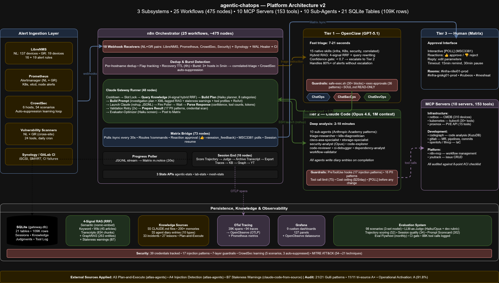

# agentic-chatops — Comprehensive Technical Reference

Production agentic ChatOps/ChatSecOps/ChatDevOps platform implementing all 21 design patterns from Antonio Gulli's *Agentic Design Patterns* (Springer, 2025). Tri-source audited against [Anthropic's official documentation](https://docs.anthropic.com/) (17 sources), the [Anthropic Academy](https://academy.anthropic.com/) sub-agent design course, and [6 industry references](docs/industry-agentic-references.md). Includes a [Karpathy-style compiled knowledge base](wiki/index.md) — 44 articles auto-compiled from 7+ sources with 5-signal RAG integration (semantic + keyword + wiki + [MemPalace](https://github.com/milla-jovovich/mempalace) session transcripts + chaos baselines).

> **For a concise overview, see [README.md](README.md).**

---

## Table of Contents

1. [What Makes This Different](#1-what-makes-this-different)
2. [Evaluation System](#2-evaluation-system)
3. [RAG Pipeline](#3-rag-pipeline)
4. [Compiled Knowledge Base (Karpathy-Style Wiki)](#4-compiled-knowledge-base-karpathy-style-wiki)
5. [Data & Intelligence](#5-data--intelligence)
6. [The 3-Tier Agent Architecture](#6-the-3-tier-agent-architecture)
7. [Alert Lifecycle (End-to-End)](#7-alert-lifecycle-end-to-end)
8. [Three Agentic Subsystems](#8-three-agentic-subsystems)
9. [Agentic Design Patterns — 21/21](#9-agentic-design-patterns--2121)
10. [n8n Workflows](#10-n8n-workflows-25-424-nodes)
11. [MCP Servers](#11-mcp-servers-10-153-tools)
12. [Sub-Agents](#12-sub-agents-11)
13. [Claude Code Skills & Hooks](#13-claude-code-skills--hooks)
14. [OpenClaw Tier 1 Skills](#14-openclaw-tier-1-skills-15)
15. [ChatSecOps — Security Operations](#15-chatsecops--security-operations)
16. [Guardrails & Safety](#16-guardrails--safety)
17. [Inter-Agent Communication](#17-inter-agent-communication-nl-a2av1)
18. [Operating Modes & Commands](#18-operating-modes--commands)
19. [Repository Structure](#19-repository-structure)
20. [Installation](#20-installation)
21. [References](#21-references)
22. [OpenAI Agents SDK Adoption Batch](#22-openai-agents-sdk-adoption-batch)
23. [QA Suite](#23-qa-suite)
24. [Preference-Iterating Prompt Patcher](#24-preference-iterating-prompt-patcher)
25. [CLI-Session RAG Capture](#25-cli-session-rag-capture)
26. [Skill Authoring Uplift (agents-cli audit, 2026-04-23)](#26-skill-authoring-uplift-agents-cli-audit-2026-04-23)
27. [NVIDIA DLI Cross-Audit + P0+P1 Implementation (2026-04-29)](#27-nvidia-dli-cross-audit--p0p1-implementation-2026-04-29)

---

## 1. What Makes This Different

Most agentic ChatOps projects stop at "LLM reads alert, posts summary." This one closes the loop end-to-end:

- **Self-improving prompts with A/B trials** -- An eval flywheel (58 eval scenarios + 54 adversarial tests, LLM-as-a-Judge, monthly cycle) detects weak dimensions. The newer **preference-iterating patcher** ([IFRNLLEI01PRD-645](#24-preference-iterating-prompt-patcher), 2026-04-20) generates 3 candidate variants and a control arm per low-scoring dimension, routes future sessions deterministically via BLAKE2b hash, and promotes winners via a one-sided Welch t-test. Prompt-level policy iteration — no model weights ever fine-tuned.
- **AWX runbook integration** -- 41 Ansible playbooks are queryable at plan time. The planner injects proven AWX templates into investigation plans ("Run Template 69 with dry_run=true"), turning ad-hoc SSH into repeatable automation.
- **Predictive alerting** -- Regression detector (6h cron) and metamorphic monitor catch quality degradation before operators notice. Cost-adaptive routing switches to plan-only mode when category spend exceeds $3 average.
- **GraphRAG** -- 263 entities and 127 relationships (host, alert_rule, incident, lesson) in a knowledge graph. Enables queries like "what alerts does this host trigger?" and "what lessons apply to this alert rule?" beyond flat vector search.
- **OTel tracing** -- 88K+ tool calls instrumented with OpenTelemetry spans (duration, exit code, error type). Exported to OpenObserve for cross-session trace correlation and performance debugging.
- **Karpathy-style compiled wiki** -- 44 articles auto-compiled daily from 7 fragmented knowledge stores (memories, CLAUDE.md files, incidents, lessons, OpenClaw, docs, 03_Lab). Answers "what do we know about host X?" in one lookup instead of five.
- **CLI sessions flow into RAG** -- Interactive `claude` CLI sessions (no YT webhook, no Runner workflow) used to produce knowledge that only cost/tokens were captured. The [CLI-session RAG capture pipeline](#25-cli-session-rag-capture) ([-646/-647/-648](#25-cli-session-rag-capture), 2026-04-20) threads every JSONL through archive → tool-call parse → `gemma3:12b` knowledge extraction → `incident_knowledge` with `project='chatops-cli'`. Retrieval weights CLI rows at 0.75× so real incidents still win ties. Idempotent, watermarked, breaker-aware.
- **Skill authoring discipline matched to `google/agents-cli`** -- A 2026-04-23 audit against [`google/agents-cli`](https://github.com/google/agents-cli) flagged six skill-authoring dimensions where we trailed (phase-gate choreography, discoverability, anti-guidance, inline behavioral anti-patterns, governance/versioning, skill index). An 11-commit uplift ([#26](#26-skill-authoring-uplift-agents-cli-audit-2026-04-23), Phases A→J) closed every gap: master `chatops-workflow` phase-gate skill (force-injected into every Runner session), auto-generated drift-guarded `docs/skills-index.md`, `version:` + `requires:` frontmatter on every skill, 46 Shortcuts-to-Resist rows inline on 11 agents, `evidence_missing` risk signal, `config/user-vocabulary.json` — scorecard 3.94 → **4.94**.

---

## 8. Three Agentic Subsystems

| Subsystem | Scope | Matrix Rooms | Alert Sources | Triage Scripts |
|-----------|-------|-------------|---------------|----------------|
| **ChatOps** | Infrastructure availability, performance, maintenance | `#infra-nl-prod`, `#infra-gr-prod` | LibreNMS, Prometheus, Synology DSM | [infra-triage](openclaw/skills/infra-triage/), [k8s-triage](openclaw/skills/k8s-triage/), [correlated-triage](openclaw/skills/correlated-triage/) |
| **ChatSecOps** | Security: intrusion detection, vulnerability scanning, MITRE ATT&CK | Same rooms (shared) | CrowdSec, vulnerability scanners | [security-triage](openclaw/skills/security-triage/), [baseline-add](openclaw/skills/baseline-add/) |
| **ChatDevOps** | Software development: CI/CD, features, bugs | `#cubeos`, `#meshsat` | GitLab CI | Code analysis via Claude Code + 4 dev sub-agents |

All three share: n8n orchestration (Runner, Bridge, Session End, Poller), Matrix as human-in-the-loop, YouTrack for issue tracking, and the 3-tier agent architecture.

---

## 6. The 3-Tier Agent Architecture



<details>
<summary>ASCII fallback</summary>

```
LibreNMS/Prometheus/CrowdSec Alert
         |
         v
   +--------------+     +---------------+     +------------------+
   |  n8n          |---->|  OpenClaw      |---->|  Claude Code      |
   |  Orchestrator |     |  (Tier 1)     |     |  (Tier 2)         |
   |  25 workflows |     |  GPT-5.1      |     |  Claude Opus 4.6  |
   |  26 workflows |     |  17 skills    |     |  11 sub-agents    |
   +---------+-----+     +---------------+     +---------+---------+
             |                                           |
             v                                           v
   +--------------+                              +---------------+
   |  Matrix       |<-----------------------------|  Human (T3)    |
   |  Chat rooms   |  polls, reactions, replies   |  Approval      |
   +--------------+                              +---------------+
```
</details>

- **Tier 1 (OpenClaw v2026.4.11 / GPT-5.1):** Fast triage (7-21s). 17 native skills + Active Memory plugin. Creates YouTrack issues, deduplicates alerts, extracts procedural knowledge from CLAUDE.md files + operational memory rules, investigates via SSH/kubectl, runs semantic search locally (Ollama on same subnet), outputs confidence scores. Handles 80%+ of alerts without escalation.
- **Tier 2 (Claude Code / Opus 4.6):** Deep analysis (5-15 min). 11 specialized sub-agents (Haiku for research, Opus for security). Receives targeted CLAUDE.md file paths + auto-retrieved operational memories in Build Prompt. Reads Tier 1 findings (now enriched with CLAUDE.md context), verifies using ReAct reasoning, proposes remediation via interactive polls, executes after human approval. For complex sessions, delegates research to sub-agents IN PARALLEL.
- **Tier 3 (Human):** Clicks a poll option in Matrix, reacts with thumbs up/down, or types a reply. The system stops and waits — it never makes infrastructure changes autonomously.

---

## 9. Agentic Design Patterns — 21/21

Benchmarked against all 21 patterns from Antonio Gulli's book + dual-source audited against [Anthropic's official documentation](https://docs.anthropic.com/) (17 sources). Full audit: [`docs/agentic-patterns-audit.md`](docs/agentic-patterns-audit.md). Book gap analysis: [`docs/book-gap-analysis.md`](docs/book-gap-analysis.md). Industry references: [`docs/industry-agentic-references.md`](docs/industry-agentic-references.md).

**Score: 16 A/A+ (7 at A+) and 5 A-**

| # | Pattern | Grade | Implementation | Book Chapter |
|---|---------|-------|---------------|-------------|
| 1 | **Prompt Chaining** | A | n8n 44-node Runner: lock -> cooldown -> RAG -> Build Prompt -> Launch -> Parse -> Validate -> Post. Sequential with programmatic gates between steps. | Ch1 |
| 2 | **Routing** | A- | Issue prefix -> Matrix room -> session slot. 8 alert categories auto-detected (availability, resource, storage, network, kubernetes, certificate, maintenance, correlated). | Ch2 |
| 3 | **Parallelization** | A- | 5 concurrent session slots (cubeos, meshsat, dev, infra-nl, infra-gr). Async Progress Poller. Sub-agents launched in parallel for complex sessions. | Ch3 |
| 4 | **Reflection** | A- | Cross-tier review: OpenClaw critiques Claude output with 5-step chain-of-verification (REVIEW_JSON: AGREE/DISAGREE/AUGMENT). Self-consistency check detects confidence/reasoning mismatches. | Ch4 |
| 5 | **Tool Use** | A | 10 MCP servers, 153 tools. Custom Proxmox MCP (15 tools). n8n-as-code offline schemas for 537 nodes. `ToolSearch` for deferred tool discovery. | Ch5 |
| 6 | **Planning** | A- | Interactive [POLL] plan selection via MSC3381 Matrix polls. Plan-only mode (`--plan` flag) for multi-file dev tasks and correlated bursts. | Ch6 |
| 7 | **Multi-Agent** | **A+** | 3-tier hierarchy + 10 specialized sub-agents (6 infra + 4 dev) with [Anthropic Academy](https://academy.anthropic.com/) patterns: structured output, obstacle reporting, limited tools, no expert claims, parallel not sequential. Pipeline delegation for complex sessions. | Ch7 |
| 8 | **Memory** | **A+** | All 3 memory types (semantic, episodic, procedural) active across both tiers. 55 CLAUDE.md files auto-routed by hostname to triage. 117 feedback memory files synced across both agent hosts. Procedural rules ("NEVER do X") injected into Tier 1 triage output and Tier 2 Build Prompt. SQLite (31 tables, 150K+ rows incl. `session_transcripts`, `agent_diary`, `otel_spans`, `tool_call_log`). Vector embeddings (nomic-embed-text, 768 dims). Lessons-to-prompt pipeline. **[Karpathy-style compiled wiki](wiki/index.md)** — 44 articles synthesizing all memory types into organized, browsable knowledge with health checks. | Ch8 |
| 9 | **Learning & Adaptation** | **A+** | Closed-loop: session creates feedback memory → next triage auto-surfaces it → agent acts on it. A/B prompt testing (react_v1 vs react_v2). Outcome scoring. Lessons-to-prompt pipeline (30d). Regression detection (6h cron). Metamorphic monitor (auto-variant promotion at 25+ sessions). | Ch9 |
| 10 | **MCP** | A | 10 servers including custom Proxmox MCP (15 tools). mcporter Docker bridge for OpenClaw. Tool search enabled by default. Per-tool allowlisting in settings. | Ch10 |
| 11 | **Goal Setting** | A- | Confidence gating (< 0.5 = STOP, < 0.7 = escalate). Budget enforcement ($5/session warning, $25/day plan-only). Dynamic timeout by complexity (300-600s). Formalized contracts (`CONTRACT:` block in YT description). | Ch11 |
| 12 | **Exception Handling** | A | 5-layer gateway watchdog (n8n health, workflow activation, proactive bounce, error detection, zombie cleanup). `ERROR_CONTEXT` structured propagation (failed step, completed steps, suggested next action). Fallback ladders (AWX -> API -> SSH -> Ping). | Ch12 |
| 13 | **Human-in-the-Loop** | A | MSC3381 polls rendered in Matrix Element client. Thumbs up/down reactions. 15min remind / 30min auto-pause approval timeouts. AUTHORIZED_SENDERS filter. Formalized contracts define acceptance criteria. | Ch13 |
| 14 | **RAG** | **A+** | **5-signal hybrid RRF:** (1) semantic — vector embeddings (nomic-embed-text, 768 dims) with cosine similarity and `search_query:` / `search_document:` asymmetric prefixes; (2) keyword — SQL LIKE on hostname/alert/resolution; (3) **wiki articles** — 44 compiled knowledge base articles (970 section-rows indexed with `source_mtime`); (4) **session transcripts** — verbatim exchange-pair chunks ([MemPalace](https://github.com/milla-jovovich/mempalace), weight 0.4); (5) **chaos baselines** — chaos experiment results by hostname (weight 0.35). All fused via Reciprocal Rank Fusion. **G1 cross-encoder rerank** via dedicated bge-reranker-v2-m3 service on gpu01:11436. **G2 RAG Fusion** via `rewrite_query_multi` (4 variants, batch-embedded). **G3 LongContextReorder** (`long_context_reorder()` + `LCR_ENABLED=1`). **G5 KG traversal** with 3-tier progressive widening (strict → filters OR'd → entity_type dropped → embedding fallback). **Temporal window filter** on `wiki_articles.source_mtime` for "last 48h" queries. **mtime-sort intent detector** bypasses semantic retrieval for "name three memory files created in the last 48h" class queries. **Haiku synth** (Anthropic API, `SYNTH_BACKEND=auto`) composes cross-chunk answers when top rerank < 0.4. **4/4 FAISS HNSW indexes** pre-synced at `/var/claude-gateway/vector-indexes/` as migration-ready parallel write path. All JSON callers unified on `JSON_MODEL=qwen2.5:7b` (100% first-try JSON reliability, 20-query test). Plus deterministic channel: hostname-routed CLAUDE.md extraction (55 files, category-aware grep). Triage RAG at Step 1.5 (semantic) + Step 2-kb (CLAUDE.md + memory). 3-tier injection for Tier 2. Backfill cron every 30min. Wiki recompiled daily. | Ch14 |
| 15 | **A2A Communication** | A | [NL-A2A/v1 protocol](docs/a2a-protocol.md). Agent cards ([`a2a/agent-cards/`](a2a/agent-cards/)). Message envelope with protocol, messageId, from/to, type, payload. REVIEW_JSON auto-action. Task lifecycle logging. 53 A2A entries. | Ch15 |
| 16 | **Resource Optimization** | **A+** | Haiku/Opus model routing for sub-agents (9:1 cost ratio). JSONL token-based cost tracking from stream-json. Per-category cost prediction. Dynamic timeout. $5/session + $25/day budget. Subsystem-level cost metrics. | Ch16 |
| 17 | **Reasoning** | A | ReAct (THOUGHT/ACTION/OBSERVATION) mandatory for infra. Step-back prompting for recurring alerts. Tree-of-thought (H1/H2 hypotheses) for correlated bursts. Self-consistency check. Chain-of-verification for cross-tier reviews. A/B variant testing. | Ch17 |
| 18 | **Guardrails** | **A+** | 7-layer defense: [`unified-guard.sh`](scripts/hooks/unified-guard.sh) — 78 blocked patterns (37 destructive + 22 exfil + 7 injection) + 12 protected file patterns + **word-boundary precision** on single-word commands (passwd/useradd/shutdown/halt/mkfs) that distinguishes command invocation (blocked) from prose mention (allowed) via `(^|[;&\|])\s*(sudo\s+)?WORD(\s|$|--)`; 22-check harness validates both block and allow cases. Plus safe-exec.sh + exec-approvals.json (36 patterns) + input sanitization (42 injection patterns) + credential/PII scanning (16 regex) + output fact-checking + **Evaluator-Optimizer** (Haiku screening for high-stakes responses, 3 nodes). Per-source token caps on injected knowledge. Tool call limit (75). Zero hardcoded passwords. | Ch18 |
| 19 | **Evaluation** | **A+** | 19-surface [Prompt Scorecard](scripts/grade-prompts.sh) (6 dimensions, daily). [Agent Trajectory](scripts/score-trajectory.sh) (8 infra / 4 dev steps). [LLM-as-a-Judge](scripts/llm-judge.sh) (Haiku/Opus, 5 dimensions, [calibrated](scripts/judge-calibrate.sh)). **58 test scenarios** (22+20+16) across [3 eval sets](docs/evaluation-process.md) (regression/discovery/holdout) + 54 adversarial tests + 18 node-level tests + 12 negative controls. [CI eval gate](.gitlab-ci.yml). [Eval flywheel](scripts/eval-flywheel.sh) (monthly). Reproducibility (temp=0, seed=42). | Ch19 |
| 20 | **Prioritization** | A | Sub-agent routing by session complexity. Burst detection (3+ hosts = correlated triage). Flap escalation (2+ cycles). Cost-adaptive plan mode ($3+ category average). Dynamic timeout by complexity. | Ch20 |
| 21 | **Exploration** | A | Daily [proactive health scan](openclaw/skills/proactive-scan/) (disk, certs, stale issues, VPN). Security discovery (expired baselines, unscanned VMs, CrowdSec blocklist freshness, scanner VM health). CrowdSec learning loop (auto-suppression with feedback). | Ch21 |

### Appendix A Techniques (from Book)

| Technique | Status | Implementation |
|-----------|--------|---------------|
| Negative few-shot | Done | Bad response example in Build Prompt |
| Operator context (Persona Pattern) | Done | Solo admin profile injected |
| APE (Automated Prompt Engineering) | Prerequisites done | A/B active, goldset built, blocked on 200+ labeled sessions |
| Factored cognition | Monitoring | Goldset T8 tracks % complex sessions, triggers at 20% |
| Metamorphic self-restructuring | Lite | 4 self-mod monitors (variant promotion, cost-adaptive, rollback, topology signals) |

---

## Holistic Platform Health Check

[`scripts/holistic-agentic-health.sh`](scripts/holistic-agentic-health.sh) — **142 automated checks** across 37 sections that verify every feature claimed in this README actually works in production. Not just "does the file exist?" — functional tests, cross-site verification, and e2e smoke tests.

**Latest score: 96%** (quick mode) in 18 seconds.

```bash
./scripts/holistic-agentic-health.sh            # Full run (142 checks, ~18s)
./scripts/holistic-agentic-health.sh --quick     # Skip SSH/kubectl (~8s, 96%)
./scripts/holistic-agentic-health.sh --smoke     # Include e2e synthetic alert test
./scripts/holistic-agentic-health.sh --json      # Machine-readable output
```

### What It Tests

| Section | Checks | What's Verified |
|---------|--------|-----------------|
| n8n Workflows | 9 | 26 active, 7 critical workflows, execution error rate (<10%) |
| SQLite Tables | 12 | 31 tables, 150K+ rows, 8 staleness thresholds (per-table freshness) |
| MCP Servers | 1 | Process count for all 10 MCP servers |
| RAG Pipeline | 5 | Semantic search, wiki articles, transcripts, GraphRAG, **functional search test** (known incident) |
| Session End Pipeline | 7 | 18 nodes, all 6 critical nodes present (Score Trajectory → Populate Graph) |
| OpenClaw Tier 1 | 2 | 29 skills, container running |
| Claude Code | 3 | 10 agents, 5 skills, 3 hook events |
| Eval Pipeline | 12 | 58 eval scenarios (3 sets) + 54 adversarial, 5 scripts, judgments, **functional trajectory test** |
| Safety Guardrails | 3 | 42 injection patterns, 89 blocked patterns, exec-approvals |
| Observability | 5 | 39K OTel spans, 88K tool calls, 3 Grafana datasources, 28 dashboards, **139/139 Prometheus targets UP** |
| Crons | 1 | 38 active cron entries |
| Self-Improving Prompts | 2 | 5 prompt patches, prompt-improver executable |
| Predictive Alerting | 2 | Script + daily cron configured |
| Compiled Wiki | 3 | 44 articles, daily cron, compile freshness (<48h) |
| A2A Protocol | 2 | 3 agent cards, 53 task log entries |
| AWX Runbooks | 3 | Plan-and-execute scripts, **live AWX API query** |
| Ollama | 3 | 20 models, nomic-embed-text, **768-dim embedding generated** |
| LibreNMS | 2 | 123 NL devices, 19 GR alert rules |
| Key Scripts | 16 | All 16 production scripts exist and are executable |
| Knowledge Injection | 2 | 55 CLAUDE.md files, 117 memory files |
| Credential Rotation | 1 | No overdue credentials |
| VTI Tunnels | 2 | **6/6 IKEv2 SAs READY** (SSH to ASA), cross-site ping 42ms |
| Matrix Bot | 2 | @claude in 7 rooms, **message POST to #alerts** |
| Prompt Patches TTL | 1 | No expired-but-active patches |
| CrowdSec Stats | 1 | 5 scenarios tracked |
| OpenObserve | 1 | healthz 200 |
| Webhook Functional | 1 | agentic-stats API returns valid JSON |
| Gateway Mode | 2 | Valid mode (oc-cc), no maintenance lock |
| Session Continuity | 1 | Last session_id queryable |
| Runner Build Prompt | 5 | 48 nodes, 4 critical nodes (Build Prompt, Query Knowledge, Build Plan, Evaluator) |
| External Services | 5 | YouTrack API, **NetBox CMDB (307 objects)**, Matrix POST, GitHub mirror (<72h), OpenClaw LLM reachable |
| Infra Health | 6 | **7/7 K8s nodes**, PVE quorum, **7 BGP peers**, GPU 46°C, Thanos query, DNS |
| Data Integrity | 5 | Embeddings (33/33), queue depth, DB backup (<26h), JSONL poller, token caps in Build Prompt |
| Security | 4 | Scanner NL (<26h), scanner GR (<26h), MITRE Navigator, CrowdSec bans |
| Cross-Site Sync | 3 | OpenClaw memories, GR claude host, **syslog-ng (NL: 18, GR: 184K lines/day)** |
| Operational | 6 | Freedom WAN SLA UP, Docker containers, n8n-as-code, **19/19 scorecard surfaces**, watchdog, **4 VPS SAs** |
| Smoke (--smoke) | 3 | Synthetic LibreNMS alert → YT issue created → cleanup |

### Historical Trending

Each run stores results in `health_check_results` and `health_check_detail` SQLite tables. The trend line shows score progression across runs. Prometheus metrics exported to `/var/lib/node_exporter/textfile_collector/holistic_health.prom`.

---

## 7. Alert Lifecycle (End-to-End)

```
1. LibreNMS detects "Devices up/down" on host X
2. n8n LibreNMS Receiver -> dedup, flap detection, burst detection
3. Posts to Matrix #infra room: "[LibreNMS] ALERT: host X -- Devices up/down"
4. OpenClaw (Tier 1) auto-triages:
   a. Checks YouTrack for existing issues (24h dedup)
   b. Creates issue IFRNLLEI01PRD-XXX
   c. Queries NetBox CMDB for device identity
   d. Queries incident knowledge base (semantic search via local Ollama, Step 1.5)
   e. Extracts CLAUDE.md procedural knowledge + operational memory rules (Step 2-kb)
   f. Investigates via SSH (PVE status, container logs)
   g. Posts findings + CONFIDENCE score to YouTrack + Matrix
   h. If confidence < 0.7 or critical: escalates to Claude Code
5. Build Plan (Haiku) generates 3-5 step investigation plan:
   a. Queries AWX API for matching Ansible playbooks (41 templates across maintenance, certs, K8s, updates)
   b. Injects proven AWX runbooks into the plan — planner references "Run AWX Template {ID} with dry_run=true"
   c. Falls back to ad-hoc investigation steps when no matching playbook exists
6. Claude Code (Tier 2) activates:
   a. Reads YouTrack issue + Tier 1 comments (now includes CLAUDE.md context)
   b. Follows the investigation plan, can launch AWX jobs via API (dry_run first, full run after [POLL] approval)
   c. Receives targeted CLAUDE.md file paths + operational memories + staleness warnings in Build Prompt
   d. For complex sessions: delegates research to sub-agents IN PARALLEL
      - triage-researcher (Haiku) for device context + incident history
      - k8s-diagnostician (Haiku) for K8s alerts
      - cisco-asa-specialist (Haiku) for firewall alerts
      - storage-specialist (Haiku) for iSCSI/ZFS alerts
   c. Synthesizes sub-agent findings
   d. Uses ReAct reasoning: THOUGHT -> ACTION -> OBSERVATION loop
   e. Proposes 2-3 remediation plans via [POLL]
6. Matrix renders interactive poll -- operator clicks preferred plan
7. Claude Code executes selected plan
8. Reports results, moves issue to "To Verify"
9. Session End (18-node pipeline):
   a. **Scores agent trajectory** from JSONL (8 infra / 4 dev steps)
   b. **LLM-as-a-Judge** evaluates response (Haiku routine, Opus for flagged)
   c. **Archives session transcript** (MemPalace: exchange-pair chunks → embeddings → 4th RAG signal)
   d. **Exports OTel traces** to OpenObserve (OTLP)
   e. **Parses tool calls** from JSONL → tool_call_log (per-tool error rates, latency)
   f. Cleans up JSONL, locks, cooldown files
   g. Populates incident_knowledge with vector embedding + extracts lessons
   h. **Populates GraphRAG** (incremental entity/relationship extraction per issue)
   i. Posts summary to YouTrack + Matrix
```

**Real incident:** IFRNLLEI01PRD-82 — full L1->L2->L3->approval->fix->recovery cycle. LibreNMS alert -> n8n -> Matrix -> OpenClaw triage (30s) -> Claude Code investigation (8min) -> [POLL] with 3 options -> operator clicks Plan A -> fix applied -> recovery confirmed -> YT closed.

---

## 10. n8n Workflows (25, 424 nodes)

| Workflow | Nodes | Subsystem | Purpose |
|----------|-------|-----------|---------|
| YouTrack Receiver | 5 | All | Webhook listener, fires Runner async |
| **Claude Runner** | 48 | All | Lock -> cooldown -> RAG -> Build Prompt (per-source token caps) -> Launch Claude -> Parse -> Validate -> **Screen (Evaluator-Optimizer)** -> Post |
| Progress Poller | 10 | All | Polls JSONL log every 30s, posts tool activity to Matrix |
| **Matrix Bridge** | 73 | All | Polls /sync, routes commands, manages sessions, handles reactions/polls |
| **Session End** | 18 | All | Summarize -> **Score Trajectory** -> **Judge Session** -> **Archive Transcript** -> **Export Traces** -> **Parse Tool Calls** -> Cleanup -> KB -> **Populate Graph** -> YT comment |
| LibreNMS Receiver (NL) | 26 | ChatOps | Alert dedup, flap detection, burst detection, recovery tracking |
| LibreNMS Receiver (GR) | 26 | ChatOps | Clone for GR site |
| Prometheus Receiver (NL) | 26 | ChatOps | K8s alert processing, fingerprint dedup, escalation cooldown |
| Prometheus Receiver (GR) | 26 | ChatOps | Clone for GR site |
| Security Receiver (NL) | 25 | ChatSecOps | Vulnerability scanner findings, baseline comparison |
| Security Receiver (GR) | 25 | ChatSecOps | Clone for GR site |
| CrowdSec Receiver (NL) | 23 | ChatSecOps | CrowdSec alerts, MITRE mapping, **scenario stats UPSERT**, auto-suppression learning |
| CrowdSec Receiver (GR) | 23 | ChatSecOps | Clone for GR site |
| Synology DSM Receiver | 7 | ChatOps | I/O latency, SMART, iSCSI errors |
| WAL Self-Healer (GR) | 18 | ChatOps | Auto-restart Prometheus on WAL corruption |
| CI Failure Receiver | 9 | ChatDevOps | GitLab pipeline webhook -> Matrix + YT comment |
| Agentic Stats API | 3 | — | Live LLM usage data for Hugo portfolio (`/webhook/agentic-stats`) |
| Lab Stats API | 3 | — | Live NetBox/K8s/ZFS data for Hugo portfolio (`/webhook/lab-stats`) |
| VPN Mesh Stats API | 3 | — | Live VPN tunnel/BGP/latency data for Hugo portfolio (`/webhook/mesh-stats`) |
| Service Health API | 3 | — | Service availability endpoint for chaos testing |
| Chaos Test Start | 3 | — | Chaos engineering: inject failure scenarios |
| Chaos Test Status | 3 | — | Chaos engineering: check active test status |
| Chaos Test Recover | 3 | — | Chaos engineering: trigger recovery |
| Chaos Logs API | 3 | — | Chaos engineering: retrieve test logs |
| Doorbell | 6 | — | UniFi Protect -> Mattermost+Matrix+HA+Frigate |

---

## 11. MCP Servers (10, 153 tools)

| MCP | Tools | Purpose |
|-----|-------|---------|
| `netbox` | ~20 | CMDB: 310 devices/VMs, 421 IPs, 39 VLANs across 6 sites |
| `n8n-mcp` | 21 | Workflow management (create, update, test, validate) |
| `youtrack` | 47 | Issue CRUD, custom fields, state transitions, search |
| `proxmox` | 15 | VM/LXC lifecycle, node status, storage (custom-built MCP) |
| `kubernetes` | 19 | kubectl get/describe/apply, logs, exec, helm, node management |
| `gitlab-mcp` | -- | MRs, pipelines, commits |
| `codegraph` | 12 | Code graph (KuzuDB), call chains, dead code, complexity |
| `opentofu` | 4 | Registry provider/resource/module docs |
| `tfmcp` | 29 | Terraform plan/apply/state, module health, security analysis |

---

## 12. Sub-Agents (11)

Designed with [Anthropic Academy](https://academy.anthropic.com/) patterns:
- **Structured output** — numbered sections with natural stopping points
- **Obstacle reporting** — every agent has an "Obstacles Encountered" section
- **Limited tool access** — read-only for researchers (no Edit/Write)
- **Specific descriptions** — shape the input prompts the main agent writes
- **Decision rule** — "Only delegate when you need the RESULT, not the journey"
- **Anti-patterns avoided** — no expert claims, no sequential pipelines, no test runners

### Infrastructure Sub-Agents (6)

| Agent | Model | MCP | Turns | Purpose |
|-------|-------|-----|-------|---------|
| [triage-researcher](.claude/agents/triage-researcher.md) | Haiku | netbox, k8s | 15 | Fast device lookup, incident history, 03_Lab reference |
| [k8s-diagnostician](.claude/agents/k8s-diagnostician.md) | Haiku | k8s, netbox | 18 | Pod/node/event diagnostics, Cilium, PVC checks |
| [cisco-asa-specialist](.claude/agents/cisco-asa-specialist.md) | Haiku | — | 15 | ASA firewall diagnostics, VPN tunnels, ACL analysis |
| [storage-specialist](.claude/agents/storage-specialist.md) | Haiku | proxmox, netbox | 15 | iSCSI, ZFS, NFS, SeaweedFS diagnostics |
| [security-analyst](.claude/agents/security-analyst.md) | **Opus** | netbox, k8s | 25 | Deep CVE/MITRE/CTI analysis, evidence collection |
| [workflow-validator](.claude/agents/workflow-validator.md) | Haiku | n8n-mcp | 12 | n8n workflow JSON validation |

### Development Sub-Agents (4)

| Agent | Model | MCP | Turns | Purpose |
|-------|-------|-----|-------|---------|
| [code-explorer](.claude/agents/code-explorer.md) | Haiku | codegraph | 15 | Codebase research, call chain tracing, file mapping |
| [code-reviewer](.claude/agents/code-reviewer.md) | Haiku | — | 12 | Fresh-eyes code review (separate context, no implementation bias) |
| [ci-debugger](.claude/agents/ci-debugger.md) | Haiku | — | 12 | CI pipeline failure diagnosis, log parsing |
| [dependency-analyst](.claude/agents/dependency-analyst.md) | Haiku | codegraph | 15 | Cross-repo impact analysis for refactoring |

### Learning Sub-Agent (1)

| Agent | Model | MCP | Turns | Purpose |
|-------|-------|-----|-------|---------|
| [teacher-agent](.claude/agents/teacher-agent.md) | Haiku | — | 15 | Socratic teacher over internal docs; SM-2 scheduling + Bloom progression + low-confidence clarifier. Read-only tool allowlist (no Edit/Write). Landed 2026-04-20 under IFRNLLEI01PRD-651..-655. Details in the [teacher-agent runbook](docs/runbooks/teacher-agent.md). |

**Anti-guidance (Phase A, 2026-04-23):** every agent description now ends with an explicit "Do NOT use for X (use /other-skill instead)" trailing clause — see [`docs/skills-index.md`](docs/skills-index.md) for the auto-generated single source of truth. **Shortcuts-to-Resist (Phase E):** each of the 11 agents carries an inline table (3–5 rows) drawn from `memory/feedback_*.md` — behavioral inoculation at the surface where the model is about to act.

**Pipeline integration:** Build Prompt detects complex sessions (timeout >= 600, correlated, kubernetes, multi-file dev) and injects `SUB-AGENT DELEGATION` instructions. Claude launches relevant sub-agents IN PARALLEL for research, then synthesizes. Saves 40-60% cost by routing research to Haiku ($1/M) vs Opus ($15/M).

---

## 13. Claude Code Skills & Hooks

### Skills (5 + 1 command)

| Skill | Delegation | Purpose |
|-------|------------|---------|
| `/triage <host> <rule> <sev>` | Forks to triage-researcher | Full infra triage with structured output |
| `/alert-status` | Inline | Show active alerts across NL+GR (6 sources) |
| `/cost-report [days]` | Inline | Session cost/confidence analysis from SQLite |
| `/drift-check [nl\|gr\|all]` | Forks to triage-researcher | IaC vs live infrastructure drift detection |
| `/wiki-compile [--full\|--health]` | Inline | Compile/refresh the [Karpathy-style knowledge base](wiki/index.md) |
| `/review` | Inline | Merge request review |

### Hooks (full lifecycle coverage after IFRNLLEI01PRD-638/639)

Deterministic enforcement — fires BEFORE permission checks, cannot be bypassed. The **3-behavior rejection taxonomy** (`allow` / `reject_content` / `deny`) mirrors the OpenAI SDK `ToolGuardrailFunctionOutput` but stays within Claude Code's exit-code contract: differentiation lives in the explanatory message + the structured `tool_guardrail_rejection` event emitted to `event_log`.

| Hook | Event | Purpose |
|------|-------|---------|
| [`unified-guard.sh`](scripts/hooks/unified-guard.sh) | PreToolUse (Bash, Edit, Write) | Merged guardrail: 78 blocked patterns (destructive + exfil + injection) + 15 protected file patterns. Deny vs reject_content distinguished by message prefix and `behavior` field in `event_log`. |
| [`audit-bash.sh`](scripts/hooks/audit-bash.sh) | PreToolUse (legacy) | Kept in sync with unified-guard: same 3-behavior taxonomy + `event_log` emission, retained for sites that wire it standalone. |
| [`protect-files.sh`](scripts/hooks/protect-files.sh) | PreToolUse (legacy) | Same: refactored for the reject_content taxonomy; never emits JSON (would fail Claude Code hook validation). |
| [`snapshot-pre-tool.sh`](scripts/hooks/snapshot-pre-tool.sh) | PreToolUse (Bash, Edit, Write, Task) | IFRNLLEI01PRD-636 — writes a `session_state_snapshot` row BEFORE each mutating tool call (read-only tools skipped) for crash-mid-tool rollback. |
| [`session-start.sh`](scripts/hooks/session-start.sh) | SessionStart | IFRNLLEI01PRD-638 — initialises turn 0 in `session_turns`, emits `agent_updated` event. |
| [`post-tool-use.sh`](scripts/hooks/post-tool-use.sh) | PostToolUse | IFRNLLEI01PRD-638 — emits `tool_ended` event, bumps `tool_count` / `tool_errors`. |
| [`user-prompt-submit.sh`](scripts/hooks/user-prompt-submit.sh) | UserPromptSubmit | IFRNLLEI01PRD-638 — advances turn, emits `message_output_created` + detects poll-response (`mcp_approval_response`). |
| [`session-end.sh`](scripts/hooks/session-end.sh) | SessionEnd | IFRNLLEI01PRD-638 — the `on_final_output` equivalent: finalises the last open turn, flips active agent back to operator via an `agent_updated` event. |
| [`mempal-session-save.sh`](scripts/hooks/mempal-session-save.sh) | Stop | Auto-saves session transcript every 15 messages ([MemPalace](https://github.com/milla-jovovich/mempalace) pattern) |
| [`mempal-precompact.sh`](scripts/hooks/mempal-precompact.sh) | PreCompact | Emergency transcript save before context compression |

---

## 14. OpenClaw Tier 1 Skills (17)

| Skill | Purpose |
|-------|---------|
| [`infra-triage`](openclaw/skills/infra-triage/) | L1+L2 infra alert triage (YT dedup -> NetBox -> investigate -> escalate) |
| [`k8s-triage`](openclaw/skills/k8s-triage/) | Kubernetes alert triage (control plane deep investigation) |
| [`correlated-triage`](openclaw/skills/correlated-triage/) | Multi-host burst analysis (master + child issues) |
| [`security-triage`](openclaw/skills/security-triage/) | Vulnerability triage with MITRE ATT&CK mapping (54 scenarios) |
| `escalate-to-claude` | Tier 2 escalation via n8n webhook |
| [`netbox-lookup`](openclaw/skills/netbox-lookup/) | CMDB device/VM/IP/VLAN lookup |
| `youtrack-lookup` | Issue CRUD operations |
| [`playbook-lookup`](openclaw/skills/playbook-lookup/) | Query incident knowledge base for past resolutions |
| [`memory-recall`](openclaw/skills/memory-recall/) | Episodic memory search by host/alert |
| [`codegraph-lookup`](openclaw/skills/codegraph-lookup/) | Code relationship analysis |
| [`lab-lookup`](openclaw/skills/lab-lookup/) | 03_Lab reference library queries (port-map, nic-config) |
| [`baseline-add`](openclaw/skills/baseline-add/) | Security baseline management (90d expiry) |
| [`proactive-scan`](openclaw/skills/proactive-scan/) | Daily health + security discovery checks |
| [`claude-knowledge-lookup`](openclaw/skills/claude-knowledge-lookup.sh) | CLAUDE.md + memory knowledge extraction (hostname-routed, category-aware) |
| [`safe-exec.sh`](openclaw/skills/safe-exec.sh) | Exec enforcement wrapper (30+ blocked patterns, rate limiting) |

---

## 15. ChatSecOps — Security Operations

### MITRE ATT&CK Coverage

54 CrowdSec scenarios + 6 scanner/infra detections mapped to **19 unique ATT&CK techniques** across 8 tactics. Auto-synced to self-hosted ATT&CK Navigator. Mapping: [`mitre-mapping.json`](openclaw/skills/security-triage/mitre-mapping.json).

### Security Alert Pipeline

```
CrowdSec ban decision -> n8n CrowdSec Receiver -> severity classification
  -> MITRE mapping -> flap detection -> burst correlation -> Matrix + YT
  -> OpenClaw security-triage -> Claude Code security-analyst (if critical)
```

### CrowdSec Learning Loop

Auto-suppression: scenarios with 20+ alerts and 0 escalations in 7d are suppressed. Un-suppressed when escalations appear. Prometheus metrics track per-scenario efficacy.

### Vulnerability Scanner Pipeline

Cross-site design: NL scanner scans GR+VPS, GR scanner scans NL+VPS (prevents single-scanner blind spots). Daily cron at 03:00/03:15 UTC. Baseline comparison with 90d expiry. SLAs: critical 24h, high 7d, medium 30d, low 90d.

---

## 5. Data & Intelligence

### SQLite Tables (35, 150K+ rows)

All 9 original versioned tables + 4 new tables from the OpenAI SDK adoption batch now carry a `schema_version INTEGER DEFAULT 1` column. Canonical definitions in [`schema.sql`](schema.sql); idempotent ALTERs via migrations 006–011. Registry: [`scripts/lib/schema_version.py`](scripts/lib/schema_version.py) (with `SCHEMA_VERSION_SUMMARIES` change notes per table, mirroring OpenAI SDK `run_state.py:131`).

| Table | Rows | Purpose |
|-------|------|---------|
| `sessions` | 62 | Active sessions (issue_id, session_id, cost, confidence, trace_id, **handoff_depth**, **handoff_chain**) |
| `session_log` | 239 | Archived sessions with full tracking fields |
| `session_quality` | 34 | 5-dimension quality scores (confidence, cost efficiency, completeness, feedback, speed) |
| `session_trajectory` | 86 | Per-session agent trajectory scores (8 infra / 4 dev step markers) |
| `session_judgment` | 46 | LLM-as-a-Judge results (5-dimension rubric, Haiku/Opus + dev rubric) |
| `session_feedback` | 1 | Thumbs up/down reactions linked to issues |
| `session_transcripts` | 838 | Verbatim JSONL exchange-pair chunks with embeddings (4th RAG signal, [MemPalace](https://github.com/milla-jovovich/mempalace)) |
| `agent_diary` | 64 | Persistent per-agent knowledge across sessions, 10 agent archetypes |
| `incident_knowledge` | 54 | Alert resolutions with vector embeddings (nomic-embed-text, 768 dims) |
| `lessons_learned` | 27 | Operational insights extracted from sessions |
| `openclaw_memory` | 101 | Episodic memory for Tier 1 triage outcomes |
| `a2a_task_log` | 53 | Inter-agent message lifecycle tracking |
| `crowdsec_scenario_stats` | 5 | CrowdSec learning loop state (3 auto-suppressed) |
| `prompt_scorecard` | 302 | Daily prompt grading (19 surfaces x 6 dimensions) |
| `llm_usage` | 112 | Per-request token/cost tracking across 3 tiers |
| `wiki_articles` | 44 | Compiled wiki articles with vector embeddings (3rd RAG signal) |
| `tool_call_log` | 88K | Per-tool invocation tracking: name, duration, exit_code, error_type |
| `execution_log` | 18K | Infrastructure SSH/kubectl commands with device, exit_code, duration |
| `graph_entities` | 360 | GraphRAG entities (host, alert_rule, incident, lesson) |
| `graph_relationships` | 193 | GraphRAG relationships (triggers, affects, resolves, depends_on) |
| `credential_usage_log` | 39 | Credential rotation tracking with 90-day policy |
| `otel_spans` | 39K | OpenTelemetry spans (local storage + OTLP export to OpenObserve) |
| `chaos_experiments` | 70 | Chaos experiment results (scenario, target, outcome, recovery_time); embeddings indexed in FAISS (4/4 tables migration-ready) |
| `chaos_exercises` | 1 | Scheduled chaos exercise records |
| `chaos_retrospectives` | 34 | Post-chaos exercise retrospectives |
| `chaos_findings` | 29 | Improvement findings from chaos exercises |
| `ragas_evaluation` | 136 | RAGAS metrics (faithfulness, precision, recall per query); hardened golden set = 33 queries (15 hard-eval tagged) across multi-hop / temporal / negation / meta / cross-corpus |
| `health_check_detail` | 1,675 | Per-check results for health trending |
| `queue` | — | Session queue for slot management |
| `event_log` | — | IFRNLLEI01PRD-637 — 13 typed event_types (tool_started/ended, handoff_*, reasoning_item_created, mcp_approval_*, agent_updated, message_output_created, tool_guardrail_rejection, agent_as_tool_call). Indexed by `session_id + emitted_at` for Grafana drill-downs. |
| `handoff_log` | — | IFRNLLEI01PRD-640 — one row per T1→T2 escalation or sub-agent spawn; records `input_history_bytes`, `compaction_applied`, `pre_handoff_count`, `new_items_count`. Holistic-health asserts one row per handoff within 5 s. |
| `session_state_snapshot` | — | IFRNLLEI01PRD-636 — immutable pre-tool snapshots (OpenAI `RunState` equivalent). `snapshot_data` mirrors the `sessions` row + aggregated `llm_usage`. 7-day retention via [`scripts/prune-snapshots.sh`](scripts/prune-snapshots.sh). |
| `session_turns` | — | IFRNLLEI01PRD-638 — one row per turn (`UNIQUE(session_id, turn_id)`). Tracks per-turn `llm_cost_usd`, input/output/cache tokens, `tool_count`, `tool_errors`, `duration_ms`. |

**Backup:** Daily at 02:00 UTC, 7-day retention, integrity checked ([`backup-gateway-db.sh`](scripts/backup-gateway-db.sh)).

### Prometheus Metrics (10 exporters, 38 cron jobs)

| Category | Metrics |
|----------|---------|
| Session performance | cost, duration, confidence, turns (per-project, 7d/30d rolling) |
| A/B testing | per-variant confidence, cost, session count |
| Cost optimization | per-category avg cost + duration, budget compliance |
| Quality | SLA MTTR avg/p90, confidence calibration per band |
| Security | false positive rate, MITRE coverage, CrowdSec efficacy per scenario |
| Guardrails | exec blocked/allowed counts, injection detection |
| Subsystem | per-subsystem sessions, confidence, cost, prompt score average |
| Prompt scorecard | per-surface per-dimension scores |
| Infrastructure | Ollama health, embedding backlog, knowledge entry count |
| RAG pipeline | `kb_retrieval_latency_seconds{quantile}`, `kb_rerank_service_up`, `kb_embedded_rows{table}`, `kb_migration_trigger_distance`, `kb_qwen_json_failure_total` |
| Hard-eval cron | `kb_hard_eval_hit_rate`, `kb_hard_eval_coverage_rate`, `kb_hard_eval_kg_coverage`, `kb_hard_eval_latency_p50_seconds`, `kb_hard_eval_latency_p95_seconds`, `kb_hard_eval_last_run_timestamp_seconds` |
| Content refresh | `kb_content_refresh_age_seconds{doc}` for all 5 auto-refreshed docs |

### RAG Alert Rules (13 alerts in `rag-pipeline-health` group)

Deployed via Atlantis to the NL K8s cluster ([`k8s/namespaces/monitoring/rag-alerts.tf`](https://gitlab.example.net/infrastructure/nl/production)). Gateway source-of-truth: [`prometheus/alert-rules/rag-health.yml`](prometheus/alert-rules/rag-health.yml).

**Staleness + absent-metric pairs** — every staleness alert has a paired `absent()` guard to catch the failure mode where the metric disappears (silent-breakage detection):

| Staleness alert (fires on old data) | Absent-metric alert (fires on missing data) |
|---|---|
| `KBWeeklyEvalStale` (>8d) | `KBWeeklyEvalMetricAbsent` (2h) |
| `KBContentRefreshStale` (>48h) | `KBContentRefreshMetricAbsent` (2h) |
| `KBOpenClawSyncStale` (>48h) | `KBOpenClawSyncMetricAbsent` (2h) |

Plus: `RAGRerankServiceDown`, `RAGLatencyP95High` (>12s post-L02 Haiku synth rebaseline), `RAGMigrationTriggered`, `RAGQwenJsonSilentFailure`, `RAGEmbeddingStagnant`, `RAGHardEvalRegression`, `KBOpenClawSyncFailing`.

The absent-metric pair pattern was added after IFRNLLEI01PRD-614 caught a live silent-failure: `weekly-eval-cron.sh` had an `awk -F': '` bug that never matched the path-print line (zero colons on it) + the emitted textfile was mode `0600` (node-exporter runs as `nobody`, couldn't read). Both fixed and regression-tested.

### Grafana Dashboards (10, 64+ panels)

- **ChatOps Platform Performance** — sessions, queue, locks, API status, costs, quality
- **Infrastructure Overview** — CPU/memory/disk per host, GPU metrics, service availability
- **Infra Alerts & Remediation** — alert rates, triage outcomes, MTTR trends
- **CubeOS Project** — pipeline success, MRs, issue states
- **MeshSat Project** — pipeline success, MRs, issue states
- **Chaos Engineering** — experiment results, recovery times, safety metrics
- **LLM Usage & Cost** — per-model token tracking, budget compliance, tier breakdown
- **RAG Quality** — retrieval scores, RAGAS metrics, embedding coverage
- **Security Operations** — CrowdSec efficacy, MITRE coverage, vulnerability SLAs
- **BGP & VPN Mesh** — tunnel status, BGP peer state, cross-site latency

---

## 2. Evaluation System

### Prompt Scorecard ([`grade-prompts.sh`](scripts/grade-prompts.sh))

Daily grading of 19 prompt surfaces on 6 dimensions (0-100):

| Dimension | Weight | What it measures |
|-----------|--------|-----------------|
| effectiveness | 30% | Avg confidence, resolution rate |
| efficiency | 15% | Cost/turns relative to median |
| completeness | 25% | Required fields present (CONFIDENCE, [POLL], ReAct) |
| consistency | 10% | Confidence variance (low = good) |
| feedback | 15% | Thumbs up/down rate |
| retry_rate | 5% | % sessions not needing retry |

Prometheus: `chatops_prompt_score{surface,dimension,window}`. Subsystem averages: `chatops_subsystem_prompt_avg{subsystem}`.

### Agent Trajectory Evaluation ([`score-trajectory.sh`](scripts/score-trajectory.sh))

Parses JSONL session transcripts and scores step sequences:
- **Infra sessions (8 steps):** NetBox lookup, incident KB query, ReAct structure, [POLL]/approval, CONFIDENCE, evidence commands, SSH investigation, YT comment
- **Dev sessions (4 steps):** CONFIDENCE, evidence, tool usage, multi-turn engagement

### LLM-as-a-Judge ([`llm-judge.sh`](scripts/llm-judge.sh))

External quality assessment via Claude API:
- **Haiku (low effort):** ALL sessions. ~$0.01/session. Routine quality check.
- **Opus (max effort):** Flagged sessions (confidence < 0.7, duration > 5min, thumbs-down). ~$0.05/session.

5-dimension rubric (1-5 each): Investigation Quality, Evidence-Based, Actionability, Safety Compliance, Completeness.

### Formalized Contracts

Structured requirements parsed from YT issue descriptions:
```
CONTRACT:
- Deliverable: Diagnosis only, no changes
- Max cost: $3
- Evidence: show running-config before and after
- Validation: confidence > 0.7
---
```

Build Prompt injects as success criteria. Agent must satisfy all requirements before marking complete.

### Additional Evaluation

| System | Frequency | Purpose |
|--------|-----------|---------|
| [Golden test suite](scripts/golden-test-suite.sh) | Biweekly + CI | 64 tests (incl. --quiet mode for regression gating) |
| [Goldset validation](scripts/goldset-validate.sh) | On demand | 9 tests + 10 synthetic scenarios for APE readiness |
| [Regression detector](scripts/regression-detector.sh) | Every 6h | 7d rolling confidence/cost/duration comparison, CrowdSec checks |
| [Metamorphic monitor](scripts/metamorphic-monitor.sh) | Every 6h | Auto-variant promotion, cost-adaptive routing, self-healing rollback |
| A/B testing | Continuous | react_v1 vs react_v2, deterministic by issue hash |

---

## 16. Guardrails & Safety

7-layer defense-in-depth — not just prompt instructions:

| Layer | Mechanism | Level | Cannot be bypassed by |
|-------|-----------|-------|----------------------|
| **Claude Code hooks** | [`unified-guard.sh`](scripts/hooks/unified-guard.sh): 78 blocked patterns (37 destructive + 22 exfil + 7 injection) + 12 protected file patterns. Merged guardrail for Bash, Edit, Write. | Deterministic | Anything — fires before permission check |
| **Exec enforcement** | [`safe-exec.sh`](openclaw/skills/safe-exec.sh): 30+ blocked patterns, rate limiting (30/min), exfiltration detection | Code | Prompt injection |
| **exec-approvals.json** | 36 specific skill patterns, no wildcards | Config | Prompt instruction |
| **Input sanitization** | 17 prompt injection patterns (encoding obfuscation, role confusion, delimiter injection, social engineering, instruction planting) stripped from inputs | Code | Direct bypass |
| **Credential scanning** | 16 PII/credential regex patterns redact tokens/keys before Matrix posting | Code | N/A |
| **Approval gates** | Infrastructure changes require human thumbs-up or poll vote | Workflow | Agent autonomy |
| **Evaluator-Optimizer** | Haiku screening for high-stakes responses (3 nodes in Runner). Rewrites or escalates before posting. | Workflow | Agent self-approval |

Additional: AUTHORIZED_SENDERS filter, **EUR 5/session cost warning + $25/day plan-only** budget ceiling, zero hardcoded passwords (all env vars sourced from `.env`), confidence gating (< 0.5 = STOP).

### Adversarial Red-Team Program

54 test cases (32 baseline + 22 adversarial) in [`test-hook-blocks.py`](scripts/test-hook-blocks.py). Tests prompt injection bypass (unicode homoglyphs, base64 encoding, variable expansion), tool chaining misuse (wget+execute, python os.system, curl POST exfil), indirect exfiltration (DNS, log injection, /proc), and cross-tier escalation (docker exec, pct exec, kubectl exec). Quarterly schedule via chaos-calendar.sh. 12 bypass vectors hardened; 8 remaining tracked for follow-up.

### RAGAS RAG Quality Metrics

[`ragas-eval.py`](scripts/ragas-eval.py) evaluates RAG quality using Claude Haiku as judge (pure Python, no external deps):
- Faithfulness: 0.88 (claim decomposition + NLI verification)
- Context Precision: 0.86 (weighted precision@k)
- Context Recall: 0.88 (reference coverage)

Golden set hardened April 2026 from 18 saturated queries (couldn't measure pipeline lifts — all configs scored 0.88+) to **33 queries with 15 hard-eval tagged** across 5 categories: multi-hop (requires ≥2 docs to answer), temporal ("last N days"), negation ("which do NOT"), meta (self-referential), cross-corpus (wiki + incident + transcript corroboration). Easy-vs-hard queries now show **10× faithfulness differential** (1.00 vs 0.10 on a 5-query sample), so retrieval changes are measurable again. Runner flags: `--limit N` and `--only-category hard-eval` for targeted runs. Prometheus metrics via [`write-ragas-metrics.sh`](scripts/write-ragas-metrics.sh).

### Weekly Hard-Retrieval Cron

[`weekly-eval-cron.sh`](scripts/weekly-eval-cron.sh) (Monday 05:00 UTC) runs [`run-hard-eval.py`](scripts/run-hard-eval.py) on the 50-query `hard-retrieval-v2` set + 10-query `hard-kg` set, emits 6 Prometheus metrics (`kb_hard_eval_hit_rate`, `kb_hard_eval_coverage_rate`, `kb_hard_eval_kg_coverage`, `kb_hard_eval_latency_p50_seconds`, `kb_hard_eval_latency_p95_seconds`, `kb_hard_eval_last_run_timestamp_seconds`). Manual baseline captured 2026-04-18: **judge_hit@5 = 0.90** (45/50), KG coverage 0.70 (7/10), p50 5.7s, p95 13.6s. Diagnostic flags: `--only-ids H06,H08,H12 --verbose --skip-kg` for per-query investigation with full retrieval chain + judge rationale.

### Chaos Engineering

47 experiments across 11 unique scenarios. 6-layer safety architecture (rate limiting, graph validation, Turnstile auth, dead-man switch, abort threshold, preflight gates). Weekly baseline, monthly tunnel sweep, quarterly DMZ drill, semi-annual game day. 1s measurement resolution. Declarative catalog (25 experiments defined). Prometheus metrics + retrospective pipeline.

Scripts: [`chaos-test.py`](scripts/chaos-test.py), [`chaos_baseline.py`](scripts/chaos_baseline.py), [`chaos-calendar.sh`](scripts/chaos-calendar.sh), [`chaos_catalog.py`](scripts/chaos_catalog.py).

### Industry Benchmark (2026-04-15)

Scored against 23 industry sources (OWASP Top 10 LLM 2025, NIST AI RMF Agentic Profile, EU AI Act, Anthropic, OpenAI, LangChain survey, Microsoft AF 1.0, Gartner AI TRiSM, Gremlin CMM, OTel GenAI conventions, RAGAS). Full report: [`docs/industry-benchmark-2026-04-15.md`](docs/industry-benchmark-2026-04-15.md).

**Score: 4.10 / 5.00 (82%) -- Optimized maturity. E2E certified: 39/39 PASS.**

Key implementations:
- OTel GenAI semantic conventions + OTLP export to OpenObserve (cron */5)
- 5/5 NIST AG-MS.1 behavioral telemetry signals
- RAGAS evaluation pipeline (faithfulness 0.88, precision 0.86, recall 0.88)
- 54-test adversarial red-team program with quarterly schedule
- EU AI Act limited-risk assessment + QMS + NIST oversight boundary framework
- CycloneDX SBOM generation in CI + model provenance chain
- Agent decommissioning procedures + 153-tool risk classification
- Automated prompt refinement with regression gating

### Governance and Compliance

[`eu-ai-act-assessment.md`](docs/eu-ai-act-assessment.md) (limited-risk) | [`quality-management-system.md`](docs/quality-management-system.md) (Art. 17) | [`oversight-boundary-framework.md`](docs/oversight-boundary-framework.md) (NIST AG-GV.2) | [`agent-decommissioning.md`](docs/agent-decommissioning.md) (AG-MG.3) | [`tool-risk-classification.md`](docs/tool-risk-classification.md) (153 tools, AG-MP.1) | [`model-provenance.md`](docs/model-provenance.md) (OWASP LLM03)

---

## 17. Inter-Agent Communication (NL-A2A/v1)

Standardized protocol for all tier-to-tier messages. Spec: [`docs/a2a-protocol.md`](docs/a2a-protocol.md).

- **Agent Cards** — machine-readable capability declarations per tier ([`a2a/agent-cards/`](a2a/agent-cards/))
- **Message Envelope** — protocol, messageId, timestamp, from/to, type, issueId, payload
- **REVIEW_JSON Auto-Action** — AGREE (auto-approve), DISAGREE (pause), AUGMENT (resume with context)
- **Task Lifecycle** — `a2a_task_log` tracks escalation -> in_progress -> completed

---

## 3. RAG Pipeline

Five RAG channels fused via 5-signal Reciprocal Rank Fusion:

### Channel 1: Semantic (vector embeddings)

| Component | Detail |
|-----------|--------|
| Embedding model | nomic-embed-text (768 dims, F16) on Ollama (RTX 3090 Ti) |
| Execution | Local on both agent hosts (Ollama reachable on same subnet, no SSH) |
| Coverage | 25/25 entries (100%), backfill cron every 30min |
| Search | Cosine similarity (threshold 0.3) + keyword fallback |
| Triage integration | Step 1.5 in infra-triage, k8s-triage, security-triage |
| Dev integration | Query Knowledge runs semantic search for CUBEOS/MESHSAT |
| Knowledge source | `incident_knowledge` table (alert resolutions with embeddings) |
| Lessons source | `lessons_learned` table (30-day window, limit 5) |
| Health monitoring | `ollama_health` + `incident_knowledge_embedded` Prometheus metrics |

### Channel 2: Deterministic (hostname-routed CLAUDE.md + memory)

| Component | Detail |
|-----------|--------|
| CLAUDE.md files | 55 across all repos (IaC, products, gateway, RFCs, websites) |
| Routing | Hostname pattern → repo subdirectory (pve/, docker/, network/, k8s/, native/, edge/) |
| Extraction | Title + hostname mentions + "Known Issue"/"Never" sections + category-specific grep |
| Memory files | 117 feedback memories with operational rules ("NEVER do X") |
| Memory sync | `*/30` cron rsyncs feedback files from app-user to openclaw01 |
| Triage integration | Step 2-kb in infra-triage, k8s-triage; Step 1b in correlated-triage |
| Tier 2 integration | Build Prompt injects targeted CLAUDE.md paths + auto-retrieved memories |
| Token budget | ~2000 chars per lookup (memories first to survive truncation) |
| Repo sync | `*/30` cron pulls all 23 repos + gateway.db read replica on openclaw01 |

### Channel 3: Compiled Wiki Articles ([Karpathy-style](https://x.com/karpathy/status/2039805659525644595))

| Component | Detail |
|-----------|--------|
| Compiler | [`wiki-compile.py`](scripts/wiki-compile.py) — reads 7+ sources, compiles 44 articles |
| Articles | Per-host pages, operational rules, incident timeline, topology, services, runbooks, lab manifest |
| Embeddings | All articles chunked by `##` heading, embedded via nomic-embed-text, stored in `wiki_articles` table |
| RRF integration | 3rd signal in `rrf_score()` alongside semantic + keyword (extends [`kb-semantic-search.py`](scripts/kb-semantic-search.py)) |
| Incremental | SHA-256 checksums in `wiki/.compile-state.json` — only recompiles changed sources |
| Health checks | Staleness detection (line-number rot), coverage gaps (incidents without lessons), inconsistency detection |
| Cadence | Daily at 04:30 UTC + on-demand via `/wiki-compile` skill |
| Browsing | Plain markdown in [`wiki/`](wiki/index.md), renderable on GitLab |

### Channel 4: Session Transcripts ([MemPalace](https://github.com/milla-jovovich/mempalace))

| Component | Detail |
|-----------|--------|
| Source | Verbatim JSONL exchange-pair chunks stored in `session_transcripts` table |
| Embeddings | nomic-embed-text (768 dims), same as incident_knowledge |
| RRF weight | 0.4 (lower than summarized incident_knowledge at 1.0 to avoid noise from raw exchanges) |
| Archiver | [`archive-session-transcript.py`](scripts/archive-session-transcript.py) — chunks JSONL into exchange pairs, embeds, gzips original |
| Hooks | Stop hook (auto-save every 15 messages) + PreCompact hook (emergency save before context compression) |
| Temporal | `incident_knowledge.valid_until` column — invalidated entries excluded from all searches |

### Channel 5: Chaos Baselines

| Component | Detail |
|-----------|--------|
| Source | `chaos_experiments` table — verdict/convergence/recovery/MTTD/targets per run |
| Embeddings | nomic-embed-text (768 dims), indexed same as other signals |
| RRF weight | 0.35 |
| Purpose | "What did we learn from killing this tunnel last time?" answered by retrieval, not by running a new chaos test |
| FAISS parity | 70/70 vectors mirrored into `/var/claude-gateway/vector-indexes/chaos_experiments.faiss` (4/4 tables now covered — migration-ready) |

### Retrieval Intent Detectors (IFRNLLEI01PRD-609 / IFRNLLEI01PRD-616)

| Detector | Trigger | Behavior |
|---|---|---|
| **Temporal window** | Regex-matches "last N hours/days", "N hours ending YYYY-MM-DD", "on YYYY-MM-DD" | Filters `wiki_articles` by `source_mtime` column so stale hits are dropped. Adds `SELECT ... WHERE source_mtime BETWEEN since AND until`. |
| **mtime-sort intent** | Temporal window present AND listing verb (name/list/show/three/recent) OR created-in-window phrase | Bypasses semantic retrieval entirely. Returns top-N by `source_mtime DESC` from `wiki_articles`, path-prefix-filterable. Answers the "ls -ltm"-style question semantic search can't. |
| **Synth threshold** | Top rerank score < 0.4 | Calls **Haiku synth** via Anthropic API. On HTTP 429 / 401 / timeout / network error / forced-empty (all 5 modes injected via `SYNTH_HAIKU_FORCE_FAIL`), falls back to local qwen2.5 synth without breaking the response chain. |

CLI: `python3 scripts/kb-semantic-search.py list-recent --hours 48 --path-prefix memory/ --limit 10` returns an mtime-ranked listing directly, bypassing the RRF pipeline.

---

## 4. Compiled Knowledge Base (Karpathy-Style Wiki)

Following [Andrej Karpathy's LLM Knowledge Bases pattern](https://x.com/karpathy/status/2039805659525644595): raw data from 7+ fragmented knowledge stores is compiled into a unified, browsable markdown wiki with auto-maintained indexes and health checks.

### Why

The system accumulated knowledge across 7+ independent stores — each with its own access mechanism:
- 117 memory files (grep by keyword)
- 55 CLAUDE.md files (hostname pattern routing)
- 28 incident_knowledge rows (semantic vector search)
- 27 lessons_learned (SQL query)
- 94 openclaw_memory entries (key-value lookup)
- ~5,200 03_Lab reference files (Syncthing + lab-lookup.py)
- 51 docs (manual reading)

To answer "what do we know about nl-fw01?" required 5 separate lookups across 3 different mechanisms. No unified view existed.

### How It Works

[`scripts/wiki-compile.py`](scripts/wiki-compile.py) reads all sources, compiles them into 44 markdown articles organized by category:

| Category | Articles | Sources Used |
|----------|----------|-------------|
| **operations/** | operational-rules, runbooks, emergency-procedures, data-trust-hierarchy | feedback memories, OpenClaw skills, CLAUDE.md |
| **hosts/** | ~25 per-host pages (nl-fw01, nl-pve01, gr-fw01, ...) | CLAUDE.md + incidents + lessons + memories + 03_Lab refs |
| **incidents/** | chronological timeline + per-incident detail pages | incident_knowledge + postmortems + memories |
| **topology/** | nl-site, gr-site, vpn-mesh, k8s-clusters | CLAUDE.md (network/, edge/, k8s/) + VPN memories |
| **services/** | chatops-platform, openclaw, rag-pipeline, security-ops, seaweedfs | architecture docs + memories + skills |
| **decisions/** | architectural decisions index | project memories + audit docs |
| **lab/** | 03_Lab file manifest, NL/GR physical layer | directory walk + lab-lookup.py |
| **health/** | staleness report, coverage matrix | cross-source analysis |

**Incremental compilation:** SHA-256 checksums detect source changes. Only affected articles are recompiled. A full first compilation takes ~5s; incremental runs are instant when nothing changed.

**RAG integration:** All 44 articles are chunked by heading and embedded via nomic-embed-text. They appear as a 3rd ranking signal in the existing Reciprocal Rank Fusion search — alongside semantic (incident_knowledge) and keyword matches.

**Health checks:** The compiler detects:
- **Staleness** — memory files referencing specific line numbers that may have rotated
- **Coverage gaps** — incidents without lessons_learned, hosts in incidents without wiki pages
- **Knowledge observability** — total counts of sources compiled, gaps remaining

### Impact Assessment

Audited against all 7 benchmark frameworks. Full report: [`docs/wiki-kb-impact-audit.md`](docs/wiki-kb-impact-audit.md).

| Metric | Before | After |
|--------|--------|-------|
| Industry recommendations met | 16/17 (94%) | **17/17 (100%)** |
| Anti-patterns mitigated | 19/20 (95%) | **20/20 (100%)** |
| RAG signals | 2 (semantic + keyword) | **5 (+ wiki + session transcripts + chaos baselines)** |
| Knowledge articles | 0 | **44** |
| Lookups to answer "what do we know about host X?" | 5 | **1** |

---

## 18. Operating Modes & Commands

### Modes

| Mode | Frontend | Backend | Use Case |
|------|----------|---------|----------|
| `oc-cc` | OpenClaw | Claude Code | **Default** — full 3-tier pipeline |
| `oc-oc` | OpenClaw | OpenClaw (self-contained) | Quick lookups |
| `cc-cc` | n8n/Claude | Claude Code | Direct Claude access (legacy) |
| `cc-oc` | n8n | OpenClaw as backend | Testing |

Switch with `!mode <mode>` in any Matrix room.

### Matrix Commands

| Command | Description |
|---------|-------------|
| `!session current/list/done/cancel/pause/resume` | Session management |
| `!issue status/info/start/stop/verify/done/close` | Issue lifecycle |
| `!pipeline status/logs/retry` | GitLab CI pipelines |
| `!mode status/oc-cc/oc-oc/cc-cc/cc-oc` | Operating mode switching |
| `!system status/processes` | System health |
| `!gateway offline/online/status` | Gateway control |
| `!debug` | Dump lock, sessions, queue, cooldown state |

---

## 19. Repository Structure

```
.
├── README.md                       # Concise overview
├── README.extensive.md             # This file — full technical reference
├── CLAUDE.md                       # Claude Code project instructions (<200 lines)
├── .claude/
│   ├── agents/                     # 10 sub-agents (Anthropic Academy patterns)
│   ├── skills/                     # 5 Claude Code skills (incl. wiki-compile)
│   ├── commands/review.md          # /review command
│   ├── settings.json               # Hooks configuration (2 PreToolUse + 1 Stop + 1 PreCompact)
│   └── rules/                      # 6 path-scoped rule files
├── a2a/agent-cards/                # NL-A2A/v1 capability declarations
├── docs/
│   ├── architecture.md             # Component details (workflows, MCP, sub-agents)
│   ├── installation.md             # Setup guide with cron configuration
│   ├── agentic-patterns-audit.md   # 21/21 pattern scorecard
│   ├── book-gap-analysis.md        # Remaining improvements from Gulli's book
│   ├── industry-agentic-references.md  # 6 industry sources → cross-cutting advice (Knowledge Source #3)
│   ├── tri-source-audit.md         # Platform scored against all 3 knowledge sources (11/11 A+)
│   ├── tri-source-eval-report-2026-04-07.md  # E2E test results + before/after scoring
│   ├── aci-tool-audit.md           # 10 MCP tools audited against 8-point ACI checklist
│   ├── evaluation-process.md       # 3-set eval model, flywheel, CI gate, judge calibration
│   ├── a2a-protocol.md             # Inter-agent communication spec
│   ├── known-failure-rules.md      # 27 rules from 26 bugs
│   ├── llm-usage-tracking.md       # LLM cost tracking, Prometheus metrics, portfolio APIs
│   ├── mempalace-details.md        # MemPalace integration: tables, scripts, RAG formula
│   ├── compiled-wiki-details.md    # Wiki compiler: source mapping, CLI usage
│   └── maintenance-mode-details.md # ASA reboot suppression, Freedom ISP, PVE maintenance
├── grafana/                        # Dashboard JSON exports (10 dashboards, 64+ panels)
├── openclaw/
│   ├── SOUL.md                     # OpenClaw system prompt (623 lines)
│   ├── openclaw.json               # OpenClaw configuration
│   ├── exec-approvals.json         # 36 skill patterns (no wildcards)
│   ├── claude-knowledge-lookup.sh   # CLAUDE.md + memory knowledge extraction
│   └── skills/                     # 17 native skills (incl. 4 always-on protocol skills)
├── scripts/
│   ├── hooks/                      # 4 Claude Code hooks (2 PreToolUse + 1 Stop + 1 PreCompact)
│   ├── openclaw-repo-sync.sh       # */30 cron: git pull 23 repos + memory + DB sync to openclaw01
│   ├── grade-prompts.sh            # Daily prompt scorecard
│   ├── score-trajectory.sh         # JSONL trajectory scoring
│   ├── llm-judge.sh               # LLM-as-a-Judge (Haiku/Opus)
│   ├── golden-test-suite.sh        # 64-test benchmark
│   ├── regression-detector.sh      # 7d rolling regression
│   ├── metamorphic-monitor.sh      # Self-modification monitor
│   ├── post-reboot-vpn-check.sh    # 12 cross-site subnet probes
│   ├── backup-gateway-db.sh        # Daily SQLite backup
│   ├── kb-semantic-search.py       # 5-signal RRF search (semantic + keyword + wiki + transcripts + chaos baselines)
│   ├── wiki-compile.py             # Karpathy-style wiki compiler (7+ sources → 44 articles)
│   ├── archive-session-transcript.py  # MemPalace: JSONL → exchange-pair chunks → embeddings
│   ├── agent-diary.py              # MemPalace: persistent per-agent memory (write/read/inject)
│   ├── build-prompt-layers.py      # MemPalace: L0-L3 layered injection with token caps
│   └── ... (50 scripts total)
├── wiki/                           # Compiled knowledge base (44 auto-generated articles)
│   ├── index.md                    # Master index with categorized links
│   ├── operations/                 # Operational rules, runbooks, emergency procedures
│   ├── hosts/                      # Per-host compiled pages (~25 notable hosts)
│   ├── incidents/                  # Chronological timeline + detail pages
│   ├── topology/                   # Network topology (NL, GR, VPN mesh, K8s)
│   ├── services/                   # Service architecture (ChatOps, OpenClaw, RAG, security)
│   ├── lab/                        # 03_Lab file manifest
│   └── health/                     # Staleness report + coverage matrix
├── workflows/                      # 25 n8n workflow JSON exports
├── mcp-proxmox/                    # Custom Proxmox MCP server (15 tools)
└── .gitlab-ci.yml                  # CI: validate, test, review, GitHub sync
```

---

## 20. Installation

See [`docs/installation.md`](docs/installation.md) for full setup guide.

**Quick start:**
```bash
git clone https://github.com/papadopouloskyriakos/agentic-chatops.git
cd agentic-chatops
cp .env.example .env   # Add your credentials
```

---

## 21. References

### Knowledge Sources
1. **[Agentic Design Patterns](https://drive.google.com/file/d/1-5ho2aSZ-z0FcW8W_jMUoFSQ5hTKvJ43/view?usp=drivesdk)** by Antonio Gulli (Springer, 2025) — 21 patterns, all implemented
2. **[Claude Certified Architect – Foundations Exam Guide](docs/Claude+Certified+Architect+–+Foundations+Certification+Exam+Guide.pdf)** (Anthropic) — Sub-agent design, multi-tier architecture foundations
3. **[Industry Agentic References](docs/industry-agentic-references.md)** — 6 industry sources (Anthropic, OpenAI, LangChain, Microsoft) synthesized into cross-cutting advice: tool design, evals, memory, RAG, guardrails, 17 prioritized recommendations

### Additional References
- **[MemPalace](https://github.com/milla-jovovich/mempalace)** — 8 patterns ported: verbatim transcript storage, temporal KG, agent diaries, 4th RAG signal, L0-L3 layered injection, Stop/PreCompact hooks, contradiction detection. See [`docs/mempalace-details.md`](docs/mempalace-details.md).
- **[Andrej Karpathy — LLM Knowledge Bases](https://x.com/karpathy/status/2039805659525644595)** (Apr 2026) — Pattern for LLM-compiled wikis from raw data sources. Inspired the [compiled knowledge base](wiki/index.md).
- **[Anthropic Official Documentation](https://docs.anthropic.com/)** — Claude Code hooks, subagents, skills, MCP security, prompt engineering (17 sources audited)
- **[Anthropic Academy](https://academy.anthropic.com/)** — Sub-agent design: structured output, obstacle reporting, limited tools, decision rule
- **[MCP Security Best Practices](https://modelcontextprotocol.io/docs/tutorials/security/security_best_practices)** — Scope minimization, token validation
- **[n8n](https://n8n.io/)** — Workflow automation engine (self-hosted)
- **[Model Context Protocol](https://modelcontextprotocol.io/)** — Standardized LLM-tool integration

---

## 22. OpenAI Agents SDK Adoption Batch

On 2026-04-20 the official [openai/openai-agents-python](https://github.com/openai/openai-agents-python) repo was audited (v0.14.2, ~88K LOC) and compared to the claude-gateway substrate. The comparison surfaced 11 gaps — 9 were implemented as YT issues [IFRNLLEI01PRD-635..643](docs/runbooks/), two were explicitly deferred (output guardrails + per-tool guardrails). Net result: the system now has a **versioned, typed, recoverable agentic substrate** that the old string-based Matrix pipeline couldn't offer.

### Summary of adoptions

| # | YT | Adoption | OpenAI reference | Our take |
|---|----|----------|------------------|----------|
| 1 | [IFRNLLEI01PRD-635](docs/runbooks/) | **Schema versioning** on 9 session/audit tables | `src/agents/run_state.py:131` `CURRENT_SCHEMA_VERSION` + `SCHEMA_VERSION_SUMMARIES` | Central registry [`scripts/lib/schema_version.py`](scripts/lib/schema_version.py); every writer stamps `schema_version=1`; readers `check_row()` fail-fast on future versions. |
| 2 | [IFRNLLEI01PRD-636](docs/runbooks/) | **Immutable per-turn snapshots** | `src/agents/run_state.py` `RunState` immutable dataclass | `session_state_snapshot` table + [`scripts/lib/snapshot.py`](scripts/lib/snapshot.py) `capture/latest/rollback_to/prune`. Hook captures BEFORE each mutating tool; 7-day retention. |
| 3 | [IFRNLLEI01PRD-637](docs/runbooks/) | **Typed event taxonomy** — 13 event subtypes | `src/agents/stream_events.py` 11 `RunItemStreamEvent` subtypes | [`scripts/lib/session_events.py`](scripts/lib/session_events.py) dataclasses + `event_log` table + [`scripts/emit-event.py`](scripts/emit-event.py) CLI + [`scripts/write-event-metrics.sh`](scripts/write-event-metrics.sh) Prometheus exporter. |
| 4 | [IFRNLLEI01PRD-638](docs/runbooks/) | **Per-turn lifecycle hooks** | `src/agents/lifecycle.py` `RunHooks` (`on_agent_start/end`, `on_llm_start/end`, `on_tool_start/end`, `on_handoff`, `on_final_output`) | 4 new Claude Code hooks (`session-start.sh`, `post-tool-use.sh`, `user-prompt-submit.sh`, **`session-end.sh`** = `on_final_output` equivalent) + `session_turns` table + [`scripts/lib/turn_counter.py`](scripts/lib/turn_counter.py). |
| 5 | [IFRNLLEI01PRD-639](docs/runbooks/) | **3-behavior rejection taxonomy** | `src/agents/tool_guardrails.py` `ToolGuardrailFunctionOutput` (`allow` / `reject_content` / `raise_exception`) | `unified-guard.sh` + `audit-bash.sh` + `protect-files.sh` refactored; deny vs reject_content differentiated by message prose + `tool_guardrail_rejection` event; audit invariant enforces non-empty messages. |
| 6 | [IFRNLLEI01PRD-640](docs/runbooks/) | **`HandoffInputData` envelope** | `src/agents/handoffs/__init__.py:142` | [`scripts/lib/handoff.py`](scripts/lib/handoff.py) `@dataclass` + zlib+b64 marshal (176 KB → 752 B = **0.43% ratio**) + `handoff_log` audit table. `from_b64()` fails fast on future `envelope_version`. |
| 7 | [IFRNLLEI01PRD-641](docs/runbooks/) | **Optional transcript compaction on handoff** | `src/agents/handoffs/history.py` `nest_handoff_history` | [`scripts/compact-handoff-history.py`](scripts/compact-handoff-history.py) — local `gemma3:12b` first, Haiku fallback, `rag_synth_ollama` circuit-breaker aware. `HANDOFF_COMPACT_MODE=off\|auto\|force`. Emits `handoff_compaction` event with `pre_bytes`, `post_bytes`, `model`, `ratio`. |
| 8 | [IFRNLLEI01PRD-642](docs/runbooks/) | **Agent-as-tool wrapper** for 10 sub-agents | `@function_tool` wraps an agent | [`scripts/agent_as_tool.py`](scripts/agent_as_tool.py) CLI + registry + mocked-Claude-friendly invoker. Designed for the ambiguous-risk band (0.4–0.6), complements — does not replace — our deterministic routing. |
| 9 | [IFRNLLEI01PRD-643](docs/runbooks/) | **Handoff depth counter + cycle detection** | `MaxTurnsExceeded` in `run_internal/run_loop.py` | [`scripts/lib/handoff_depth.py`](scripts/lib/handoff_depth.py) atomic bump with SQLite IMMEDIATE transactions + `PRAGMA busy_timeout=10000`. Depth ≥ 5 forces `[POLL]`, ≥ 10 hard-halts, cycles refused and logged. |

### Explicit divergences from the SDK

- **Tracing:** the SDK auto-exports spans to `api.openai.com/v1/traces/ingest` by default. We do not — our OTel pipeline goes to OpenObserve (OTLP), and event_log is SQLite-local.
- **Strict Pydantic schemas on sub-agent output:** we pass on this. Local gemma/qwen sub-agents hallucinate under strict validation; we keep soft parsing + regex fallback + confidence extraction.
- **Always-on `nest_handoff_history`:** the SDK compacts by default. We made it **opt-in per escalation** because human T1 triage wants visibility into incremental discoveries.
- **`needs_approval: bool | callable` per tool (OpenAI's gap #5):** we already have a richer multi-signal risk classifier at session level. Not adopting.
- **`OutputGuardrail` (OpenAI's gap #6):** genuine gap — **deferred**, tracked as follow-up work.

### What did not change

The outer-facing Matrix UX, OpenClaw Tier-1 skills, RAG pipeline, prompt patches, evaluation flywheel, chaos engine, MITRE mapping — all unchanged. The adoption is a substrate-layer upgrade; operator-visible behaviour only differs when something goes wrong (snapshots → rollback, cycles → refused, rejections → retry hint instead of a wall).

---

## 23. QA Suite

[`scripts/qa/run-qa-suite.sh`](scripts/qa/run-qa-suite.sh) is a pytest-style bash harness that verifies every adoption end-to-end with a JSON scorecard output.

### Scorecard (last hardened run, 2026-04-23)

```
pass=411  fail=0  skip=2  score=99.52%
```

**44 suite files** (per-issue + e2e + benchmarks + adoption-batch regressions), ~3–5 min total runtime under full-suite load, exits 0 iff `fail=0` (drop-in CI). Since the initial adoption batch landed:

- **Per-suite timeout guard** ([IFRNLLEI01PRD-724](#26-skill-authoring-uplift-agents-cli-audit-2026-04-23)) — every suite wrapped in `timeout --signal=TERM --kill-after=5 ${QA_PER_SUITE_TIMEOUT:-120}s`. Synthetic FAIL record emitted on timeout so the orchestrator never wedges silently. Validated by `test-724-per-suite-timeout-guard.sh` (5/5).
- **`test-645-prompt-trials.sh`** — 16 tests for the preference-iterating patcher (assignment hash determinism, Welch t-test edges, timeout sweeper, finalize idempotency).
- **`test-646-cli-session-rag-capture.sh`** — 12 tests spanning all three CLI-capture tiers (flag parsing, watermark roundtrip, parse-tool-calls path inference, extractor sanitization + idempotent `fetch_pending`, `CLI_INCIDENT_WEIGHT` guards).
- **`test-651-…-655-teacher-agent-*.sh`** — 62 tests covering the 5 teacher-agent tiers (foundation, intelligence, interface, loop, gate).
- **`test-656-skill-index-fresh.sh`** (6/6) — drift guard for [`docs/skills-index.md`](docs/skills-index.md); fails if `render-skill-index.py` would produce a different output than what is committed.
- **`test-660-user-vocabulary.sh`** (10/10) — schema + semantics of `config/user-vocabulary.json`; every entry is either `ambiguous` with `candidates` or has a `canonical` resolution.
- **`test-718-evidence-missing.sh`** (9/9) — `check_evidence()` + `--check-evidence` CLI mode; CONFIDENCE ≥ 0.8 claims with no code fence → `evidence_missing` signal → `[POLL]` forced.
- **`test-726-prom-alert-rules.sh`** (4/4) — runs `promtool test rules` against `prometheus/alert-rules/agentic-health.test.yml` *inside the live monitoring Prom pod*. Asserts `SkillPrereqMissing` fires at T=31m (30m `for`), clears on recovery; `SkillMetricsExporterStale` fires at T=41m.
- **`test-727-evidence-suppression.sh`** (5/5) — extracts live `jsCode` from the n8n Runner's Prepare Result node and runs 4 behavioural cases to assert `[AUTO-RESOLVE]` markers are stripped and a `GUARDRAIL EVIDENCE-MISSING:` banner is prepended when evidence is absent on high-confidence replies.

### Harness

| File | Role |
|------|------|
| [`scripts/qa/run-qa-suite.sh`](scripts/qa/run-qa-suite.sh) | Orchestrator — writes scorecard JSON + summary to `reports/` |
| [`scripts/qa/lib/assert.sh`](scripts/qa/lib/assert.sh) | Assertion DSL: `assert_eq/ne/gt/lt/contains/exit_code` + `start_test/end_test` |
| [`scripts/qa/lib/fixtures.sh`](scripts/qa/lib/fixtures.sh) | `fresh_db` (loads schema.sql + runs migrations), `make_mock_claude`, `seed_session` |
| [`scripts/qa/lib/bench.sh`](scripts/qa/lib/bench.sh) | `bench_time_ms` with p50/p95 + JSONL emit |
| [`scripts/qa/lib/mock_http.py`](scripts/qa/lib/mock_http.py) | Forking stdlib HTTP mock — ollama-ok / ollama-500 / anthropic-ok behaviors for offline compaction tests |

### Coverage

| Category | Test count |
|---|---|
| Per-issue suites (SDK batch, patcher, CLI-RAG, teacher-agent 5 tiers, agents-cli uplift) | ~35 files |
| E2E cross-cutting scenarios | 6 files — happy path, cycle prevention, crash rollback, forward-compat, envelope-to-subagent, compaction-in-handoff |
| Benchmarks | 2 files — 7 metrics captured as JSONL |
| Skill-index drift guard (-656) | 6 tests — deterministic render + diff against committed `docs/skills-index.md` |
| Skill-requires audit | 17/17 SKILL.md + agent files with `version` + `requires` frontmatter, all prereqs satisfied |
| User-vocabulary semantics (-660) | 10 tests — schema validity + `ambiguous`/`canonical` mutual exclusivity |
| `evidence_missing` signal (-718) | 9 tests — CONFIDENCE ≥ 0.8 with no code fence → signal + `[POLL]` |
| Promtool alert-rule verification (-726) | 4 tests — `SkillPrereqMissing` fires at T=31m inside live Prom pod |
| Evidence-suppression in Runner (-727) | 5 tests — Prepare Result `jsCode` extracted live + 4 behavioural cases |
| Per-suite timeout guard (-724) | 5 tests — `timeout` wrapper fires, synthetic FAIL record emitted |
| Writer stamping | **11 / 11** writers + **5 / 5** n8n workflow INSERT sites |
| Pattern-by-pattern | **53** deny patterns + **32** reject_content / allow patterns |
| Per-event payload shapes | **13 / 13** event classes |
| Concurrent safety | 8 parallel `handoff_depth.bump()` → race condition surfaced + fixed |

### Benchmarks (p95)

| Metric | p50 | p95 | Target |
|---|---|---|---|
| `event_emit_ms` | 100 | 111 | < 500 ms |
| `handoff_bump_ms` | 99 | 108 | < 500 ms |
| `handoff_envelope_encode_ms` | 74 | 76 | < 500 ms |
| `snapshot_capture_ms` | 82 | 86 | < 500 ms |
| `unified_guard_ms` (hook per Bash call) | 190 | 198 | < 500 ms |
| `handoff_compression_ratio` | — | **0.43 %** | < 10 % (beat 23×) |
| `migration_006_on_10k_rows` | — | ~200 ms | < 30 s |

### Code fixes surfaced by the suite

Writing the tests exposed five real issues that were silently present in the production-bound code:

1. **Race condition** in `handoff_depth.py` — Python's sqlite3 default `isolation_level=""` was wrapping each statement in its own implicit transaction, defeating `BEGIN IMMEDIATE` and silently losing updates under concurrent `bump()`. Fixed by switching to `isolation_level=None` + `PRAGMA busy_timeout=10000`.
2. **Legacy hooks** (`audit-bash.sh`, `protect-files.sh`) still emitted `{"decision":"allow"}` JSON — the exact pattern that triggers Claude Code "Hook JSON output validation failed" errors. Refactored to match unified-guard's silent-allow + explanatory-deny contract.
3. **`on_final_output` was simply missing** from the -638 acceptance; there was no `session-end.sh`. Implemented now.
4. **Five writers** (`agent-diary.py`, `archive-session-transcript.py`, `backfill-agent-diary.py`, `capture-execution-log.py`, `parse-tool-calls.py`) hardcoded `~/gitlab/products/.../gateway.db` instead of honouring `GATEWAY_DB`. Fixed — now testable against a temp DB.
5. **`schema.sql` was missing canonical definitions** for `event_log`, `handoff_log`, `session_state_snapshot`, `session_turns`; fresh installs depended entirely on migrations. Added CREATE TABLEs + indices so `sqlite3 gateway.db < schema.sql` now produces a complete schema.

### Running

```bash
scripts/qa/run-qa-suite.sh                    # full suite (~45 s)
scripts/qa/run-qa-suite.sh --verbose          # per-test pass/fail lines
scripts/qa/run-qa-suite.sh --filter=637       # run only 637-* suites
scripts/qa/run-qa-suite.sh --no-bench         # skip benchmarks
```

Reports land in `scripts/qa/reports/` (gitignored): `scorecard-<timestamp>.json` + `summary-<timestamp>.txt`.

---

## 24. Preference-Iterating Prompt Patcher

The original self-improving-prompts pipeline (`prompt-improver.py --apply`) was **single-shot**: when the judge detected a below-threshold dimension it generated *one* instruction patch and wrote it to `config/prompt-patches.json`. That works when the patch is good; it fails silently when the patch is marginal or worse than doing nothing.

[IFRNLLEI01PRD-645](docs/runbooks/prompt-patch-trials.md) replaced it with an **N-candidate A/B trial framework** — policy iteration at the prompt-policy level.

### Flow

```
┌────────────────────────────┐       ┌──────────────────────────────────┐
│ prompt-patch-trial.py      │       │ Runner: Query Knowledge SSH node │
│ --analyze | --start        │       │ emits PROMPT_PATCHES + new       │
│ (manual or cron)           │       │ PROMPT_TRIAL_INSTRUCTIONS lines  │
└───────────────┬────────────┘       └─────────────────┬────────────────┘
                │                                      │
                │ start_trial()                        │ prompt-trial-assign.py
                │ 3 candidates                         │ --issue X --surface S
                ▼                                      ▼
       ┌───────────────────────┐              ┌─────────────────────────┐
       │ prompt_patch_trial    │◀─── record ──│ assign_and_record() via │
       │ (status='active',     │              │ deterministic BLAKE2b   │
       │  candidates_json[])   │              └─────────────────────────┘
       └──────────┬────────────┘                        │
                  │                         ┌───────────────────────────┐
                  │                         │ session_trial_assignment  │
                  │                         │ (issue_id, trial_id,      │
                  │                         │  variant_idx)             │
                  │                         └───────────────────────────┘
                  ▼
       ┌──────────────────────┐             ┌───────────────────────────┐
       │ finalize-prompt-     │◀── Welch ───│ session_judgment          │
       │ trials.py            │   t-test    │ (per-dim scores)          │
       │ (daily cron 03:17)   │             └───────────────────────────┘
       └──────────┬───────────┘
                  │  if lift ≥ 0.05 and p < 0.1
                  └─── promote winner ────▶ config/prompt-patches.json
                                           (source: "trial:N:idx=I:label=L")
```

### Mechanics

- **3 candidate variants per low-scoring dimension:** *concise* / *detailed* / *examples*. Hand-authored in `scripts/prompt-patch-trial.py::CANDIDATE_POOL` (not LLM-generated — keeps the search space deterministic and audit-traceable).
- **Assignment:** `hash(issue_id || trial_id) % (N+1)` via BLAKE2b. Arm `N` is the no-patch control. Near-uniform distribution verified in the QA suite for 400 synthetic issue IDs.
- **Finalize criteria:** each arm must reach `PROMPT_TRIAL_MIN_SAMPLES` (default 15). One-sided Welch t-test with a normal-distribution approximation of the tail probability (avoids a scipy dependency). Winner promoted only if lift ≥ `PROMPT_TRIAL_MIN_LIFT` (0.05) **and** `p < PROMPT_TRIAL_P_THRESHOLD` (0.1). Otherwise → `aborted_no_winner`. Trials older than 14 days → `aborted_timeout` via the sweeper.
- **Race-safety:** `scripts/lib/prompt_patch_trial.py` uses `sqlite3.connect(isolation_level=None)` + `PRAGMA busy_timeout=10000` so concurrent Runner sessions assigning to the same trial don't lose writes. A partial unique index enforces one active trial per `(surface, dimension)`.
- **Opt-in:** creation is gated by `PROMPT_TRIAL_ENABLED=1`. If no trials are active the Runner's Query Knowledge node falls through to the legacy `PROMPT_PATCHES` path — zero-cost when not in use.
- **Observability:** 4 Prometheus metrics via `scripts/write-trial-metrics.sh` — `prompt_trials_active`, `prompt_trials_completed_total`, `prompt_trials_aborted_total`, `prompt_trial_winner_lift`. Grafana "ChatOps Platform Performance" dashboard has a new panel.

### Tables

- **`prompt_patch_trial`** — one row per active/completed trial. `candidates_json` is a JSON array of `{label, instruction}`. `baseline_mean` is the control arm's per-dim score at trial start. On finalize: `status`, `winner_idx`, `winner_mean`, `winner_p_value`, `reason` populated.
- **`session_trial_assignment`** — `(issue_id, trial_id, variant_idx)` audit of every assignment. Retained for rollback traceability even when the trial is closed.

Full runbook: [`docs/runbooks/prompt-patch-trials.md`](docs/runbooks/prompt-patch-trials.md). Migration: `scripts/migrations/012_prompt_patch_trial.sql`. Tests: `scripts/qa/suites/test-645-prompt-trials.sh` — 16/16 PASS.

> **Status (2026-04-20):** library + CLI + finalizer + metrics live. `PROMPT_TRIAL_ENABLED=1`. Build Prompt n8n wiring landed via a validator-gated `n8n_update_partial_workflow` on the same day. First finalize pass after the earliest trial reaches 60+ judged sessions — expect mid-May 2026.

---

## 25. CLI-Session RAG Capture

The agentic Session End workflow populates `session_transcripts`, `tool_call_log`, and `incident_knowledge` for every YT-backed Runner session. Interactive **Claude Code CLI** sessions — typed in a terminal, no webhook, no YT issue — historically only had cost/token capture via `poll-claude-usage.sh`. Their reasoning, tool use, and outcomes never reached RAG.

[IFRNLLEI01PRD-646/-647/-648](docs/runbooks/cli-session-rag-capture.md) close that gap with a **single-cron 3-tier pipeline**:

```
┌───────────────────────────────────┐
│  ~/.claude/projects/**/*.jsonl    │  ← CLI session files (UUID-named)
└────────────────┬──────────────────┘
                 ▼
┌────────────────────────────────────────────────────────────────┐
│  scripts/backfill-cli-transcripts.sh  (cron 04:30 UTC daily)   │
│  ├── Tier 1 (-646)  archive-session-transcript.py              │
│  │     chunks exchange pairs → session_transcripts + embed     │
│  │     doc-chain refine (>5000 assistant chars) → chunk_-1     │
│  ├── Tier 3 (-648)  parse-tool-calls.py  ← per-file chain      │
│  │     tool_use/tool_result pairs → tool_call_log              │
│  │     extract_issue_id_from_path() CLI fallback: cli-<uuid>   │
│  └── Tier 2 (-647)  extract-cli-knowledge.py  ← after all files│
│        gemma3:12b format=json over chunk_-1 summaries          │
│        → incident_knowledge with project='chatops-cli'         │
└────────────────────────────────────────────────────────────────┘
```

### Design decisions

- **Why `issue_id='cli-<uuid>'`:** every row in every table stays joinable by one key. A CLI session now has an `issue_id` even though no YouTrack ticket exists.
- **Why `project='chatops-cli'`:** existing `incident_knowledge` rows have empty project. The new value lets retrieval discount CLI rows without deleting them (see `CLI_INCIDENT_WEIGHT` below).
- **Why gemma3:12b local-only (no Haiku fallback):** CLI sessions are low-priority, retrieval weight is already discounted, and local capacity is adequate. Matches the 2026-04-19 judge/synth local-first flip.
- **Why byte-offset watermark:** a stable JSONL whose size hasn't grown since the last cron run is skipped entirely — no re-chunking wasted work. `~/gitlab/products/cubeos/claude-context/.cli-transcript-watermark.json`.
- **Why idempotent everywhere:** archive checks `session_transcripts(issue_id, chunk_index)` UNIQUE; parse-tool-calls skips already-processed `session_id` rows; extract skips rows with existing `incident_knowledge` via LEFT JOIN. Safe to re-run arbitrarily.

### Retrieval weighting

`kb-semantic-search.py` has a new tunable:

```python
# IFRNLLEI01PRD-647
CLI_INCIDENT_WEIGHT = float(os.environ.get("CLI_INCIDENT_WEIGHT", "0.75"))
```

In the main semantic ranker, `sim *= CLI_INCIDENT_WEIGHT` for rows where `project == 'chatops-cli'`. Real infra incidents with similar cosine similarity now rank higher in close ties. Disable by setting `CLI_INCIDENT_WEIGHT=1.0`; suppress CLI rows entirely with `0.0`.

### Soak-test numbers (2026-04-20, 10 files drained)

| Metric | Value |
|---|---|
| files processed | 10 |
| transcript chunks inserted | 12 |
| tool-call rows inserted | 245 |
| chunk_index=-1 summaries produced | 4 |
| `incident_knowledge` rows extracted | 4 |
| Tier 2 extractor elapsed (warm cache) | 21.4 s / 4 rows |
| representative extraction | `subsystem=sqlite-schema, tags=[schema, migration, versioning, data], confidence=0.95` |

### Cron

```cron
30 4 * * * /app/claude-gateway/scripts/backfill-cli-transcripts.sh --embed --oldest-first --limit 50 >> /home/app-user/logs/claude-gateway/cli-transcript-backfill.log 2>&1
```

At 50 files/night and a ~2300-file backlog, drain completes in ~46 days. Raise `--limit` to drain faster. Cron installed 2026-04-20.

### Files

| File | Role |
|---|---|
| [`scripts/backfill-cli-transcripts.sh`](scripts/backfill-cli-transcripts.sh) | Orchestrator — flag parsing, watermark, per-file chain |
| [`scripts/archive-session-transcript.py`](scripts/archive-session-transcript.py) | Tier 1 — pre-existing, CLI format already handled via `msg_type == 'user'` path (line 98-107) |
| [`scripts/parse-tool-calls.py`](scripts/parse-tool-calls.py) | Tier 3 — patched `extract_issue_id_from_path()` with CLI fallback |
| [`scripts/extract-cli-knowledge.py`](scripts/extract-cli-knowledge.py) | Tier 2 — new; Ollama `format=json`, breaker-aware, local-only |

Full runbook: [`docs/runbooks/cli-session-rag-capture.md`](docs/runbooks/cli-session-rag-capture.md). Tests: `scripts/qa/suites/test-646-cli-session-rag-capture.sh` — 12/12 PASS.

---

## 26. Skill Authoring Uplift (agents-cli audit, 2026-04-23)

A 2026-04-23 `/effort max` audit compared this repo against [`google/agents-cli`](https://github.com/google/agents-cli) v0.1.1 — a pure skill-library + closed-source PyPI-CLI wrapper for Google's ADK (seven markdown-only skills, one MkDocs site, no runtime code in the repo, PRs not accepted). Two parallel `Explore` subagents walked both codebases end-to-end; four ground-truth files were read directly (the agents-cli `workflow` + `eval` SKILL.md, our `.claude/skills/triage/SKILL.md`, and `.claude/settings.json`). Plan at `/home/app-user/.claude/plans/drifting-napping-donut.md`; audit memory at `memory/agents_cli_audit_20260423.md`.

**Headline:** claude-gateway won 9 / 16 dimensions on raw capability (runtime, state, RAG, observability, safety, human-in-the-loop, multi-site, domain breadth) but trailed decisively on the 6 **skill-authoring** dimensions (phase-gate choreography, discoverability, anti-guidance, inline behavioral anti-patterns, governance/versioning, skill index). Those six were closed in an 11-commit umbrella ([IFRNLLEI01PRD-712](docs/scorecard-post-agents-cli-adoption.md), Phases A→J) direct-pushed to main — **0 reverts, 0 hotfixes**.

### Phase-by-phase changelog

| Phase | Issue | Commit | What landed |
|-------|-------|--------|-------------|
| A | -713 | `04a6fe2` | Anti-guidance trailing clauses ("Do NOT use for X") + `## Reference Files` + `## Related Skills` on 16 `.md` files |
| B | -714 | `2d1860a` | New master [`.claude/skills/chatops-workflow/SKILL.md`](.claude/skills/chatops-workflow/SKILL.md) (Phase 0→6 lifecycle, Debugging Protocol, Proving-Your-Work directive, Shortcuts-to-Resist list, vocabulary map); CLAUDE.md shrink 40,093 → 36,319 B |
| C | -715 | `3ca3b29` | `version:` + `requires: {bins, env}` frontmatter on 17 skills/agents; [`scripts/render-skill-index.py`](scripts/render-skill-index.py) → committed [`docs/skills-index.md`](docs/skills-index.md); drift-gated by `test-656-skill-index-fresh.sh` |
| D | -716 | `dc68944` | [`scripts/audit-skill-requires.sh`](scripts/audit-skill-requires.sh) + [`scripts/write-skill-metrics.sh`](scripts/write-skill-metrics.sh) (cron `*/5`); two new alerts `SkillPrereqMissing` + `SkillMetricsExporterStale`; holistic-health §37 |
| E | -717 | `af500fa` | `## Shortcuts to Resist` tables inline on 11 agents — **46 rows** drawn from `memory/feedback_*.md` with source citations |
| F | -718 | `4aee7e5` | `check_evidence()` + `--check-evidence` CLI mode in [`scripts/classify-session-risk.py`](scripts/classify-session-risk.py); new `evidence_missing` signal forces `[POLL]` when `CONFIDENCE ≥ 0.8` but reply has no tool output / code fence |
| G | -719 | `6872841` | [`config/user-vocabulary.json`](config/user-vocabulary.json) (20 entries); prompt-submit hook scan emits typed `vocabulary` events to `event_log` |
| H | -720 | `0527d03` | Final scorecard memo [`docs/scorecard-post-agents-cli-adoption.md`](docs/scorecard-post-agents-cli-adoption.md) |
| I | -722 | `69afd12` | Runner Build-Prompt force-injection of the master skill body; marker-delimited for surgical removal; rollback anchor preserved at `/tmp/runner-pre-IMMUTABLE.json` (chmod 400) |
| (cleanup) | -724 | `0ef09cf`, `734e637` | Per-suite `QA_PER_SUITE_TIMEOUT` guard (synthetic FAIL record on wedge); per-skill semver convention at [`docs/runbooks/skill-versioning.md`](docs/runbooks/skill-versioning.md) + [`scripts/audit-skill-versions.sh`](scripts/audit-skill-versions.sh); `skill-metrics.prom` chmod 0644 fix so node_exporter can scrape |
| J1–J5 | -712 | `6047fe7`, `50d71f4`, `c4a2c46`, `f4efa7d` | E2E hardening proofs: live `vocabulary` event (`event_log` row 34), `promtool test rules` inside live Prom pod, force-injection proven by real Runner session, `check_evidence()` JS mirror in Prepare Result node, 5 pre-existing QA fails closed |

### 16-dimension scorecard (1 = worst, 5 = best-in-class)

| # | Dimension | Before | After | Evidence |
|---|-----------|:------:|:-----:|----------|
| 1 | Runtime orchestration | 5 | 5 | unchanged — 27 n8n workflows active (post-NVIDIA: +session-replay) |
| 2 | State persistence | 5 | 5 | unchanged — 43 SQLite tables (post-NVIDIA: +long_horizon_replay_results) |
| 3 | RAG / knowledge retrieval | 5 | 5 | unchanged — 5-signal RRF |
| 4 | Observability / SLOs | 5 | 5 | +1 Prom exporter (`write-skill-metrics.sh`); 2 new alerts (`SkillPrereqMissing`, `SkillMetricsExporterStale`) |
| 5 | Safety / guardrails | 4 | **5** | `evidence_missing` machine-enforces the evidence-first rule; `check_evidence()` CLI available to any caller |
| 6 | Testing / eval | 4 | **5** | +27 tests (test-656/-660/-718/-724/-726/-727) all PASS |
| 7 | Human-in-the-loop | 5 | 5 | unchanged — `[POLL]` forcing on evidence-missing is additive |
| 8 | Multi-user / multi-site | 5 | 5 | unchanged |
| 9 | **Skill authoring discipline** | **3** | **5** | 17 SKILL.md with `version` + `requires` + anti-guidance + Reference Files + Related Skills + Shortcuts |
| 10 | **Skill discoverability / index** | **2** | **5** | `render-skill-index.py` → drift-gated `docs/skills-index.md`; wired into wiki-compile |
| 11 | **"When NOT to use" anti-guidance** | **2** | **5** | trailing "Do NOT use for X (use /other-skill)" on 16 primary skills/agents |
| 12 | **Phase-gate lifecycle choreography** | **2** | **5** | `chatops-workflow/SKILL.md` (258 LOC) — Phase 0→6, exit criteria per phase, force-injected into every Runner session |
| 13 | **Behavioral anti-patterns baked into skills** | **3** | **5** | 46 Shortcuts-to-Resist rows across 11 agents (3–5 per agent), each citing the source `memory/feedback_*.md` |
| 14 | Docs site / single source of truth | 3 | 4 | auto-generated skill index eliminates CLAUDE.md drift on the skills section |
| 15 | **Governance / versioning of skill content** | **2** | **5** | semver convention + `audit-skill-versions.sh` advisory drift detection; 11 agents + master retroactively bumped `1.0.0 → 1.1.0` for Phase E/F/G additions |
| 16 | Domain breadth / depth | 5 | 5 | unchanged |

**Average:** 3.94 → **4.94** (+1.00). **Dimensions at 5:** 9/16 → **13/16** (+4). All 6 targeted gap dimensions closed (5 at 5/5, 1 at 4/5).

### Explicit non-adoptions

We deliberately did **not** copy six patterns present in agents-cli:

- **Closed-source PyPI CLI wheel** — agents-cli's actual runtime isn't in-repo. Our ops visibility is a feature.
- **MkDocs as skill-authoring surface** — we already have `wiki-site/` + `wiki-compile.py` with Lunr and embeddings.
- **Always-on `nest_handoff_history`** — our compaction is opt-in per escalation (keeps incremental-discovery visibility for T1).
- **Prose-only guardrails** — we enforce via hooks + `audit-bash.sh` + `protect-files.sh`; the agents-cli "STOP — Do NOT write code yet" prose is additive at best.
- **Zero-test repo** — we have 411 passing QA tests.
- **`npx skills add` distribution model** — we aren't a library shipped to external users; our skills are operational.

### J1–J5 hardening proofs (same-day follow-up)

The Phase H umbrella memo initially described the batch as "shipped and unit-tested". An operator audit asked "is this 100% hardened-and-proven e2e?" — the honest answer was *no*. J1–J5 closed the gap with live evidence:

| # | What was proven | How |
|---|-----------------|-----|
| J1 | `user-prompt-submit.sh` vocabulary hook wired end-to-end | Fired with literal "check the firewall" payload; `event_log` row id=34 captured with shape `{kind:vocabulary, match_type:ambiguous, phrase:"the firewall", extra:"nl-fw01;gr-fw01"}` |
| J2 | `SkillPrereqMissing` + `SkillMetricsExporterStale` alert rules fire/clear under real conditions | `test-726-prom-alert-rules.sh` runs `promtool test rules` against `prometheus/alert-rules/agentic-health.test.yml` *inside the live monitoring Prom pod* — SkillPrereqMissing at T=31m (30m `for`), SkillMetricsExporterStale at T=41m |
| J3 | Force-injected master skill body is actually read by Claude | Synthetic payload POSTed to `/webhook/youtrack-webhook`; real Runner → Claude Code pipeline fired; assistant's FIRST tool call was `grep -i "Phase 0" /tmp/claude-run-*.jsonl` and its reply opened *"Phase 0 confirmed in injected master skill body"* |
| J4 | `check_evidence()` fires on real Runner sessions (not just CLI) | Prepare Result node modified via the 11-step safety sequence (per [`docs/runbooks/n8n-code-node-safety.md`](docs/runbooks/n8n-code-node-safety.md)) — JS mirror of the Python `check_evidence()` strips `[AUTO-RESOLVE]` markers on high-confidence no-fence replies and prepends a `GUARDRAIL EVIDENCE-MISSING:` banner. `test-727-evidence-suppression.sh` extracts live jsCode + runs 4 behavioural cases (5/5 PASS) |
| J5 | 5 pre-existing QA fails closed (honest baseline) | schema.sql gained missing `content_preview` + `source_mtime` columns (migration 004/005 columns weren't codified, so fresh DBs broke teacher-agent chat); test-653 stale assertion for a removed node updated; test-637 flake cleared under the new 120 s per-suite timeout |

**Final QA state:** 397/5/2 = 98.27% → **411/0/2 = 99.52%** at the agents-cli batch close. After §27 (NVIDIA P0+P1, 2026-04-29) the suite is **468/0/2 across 51 suite files** with 7 new test files added for the G1-G4 deliverables.

### Files of record

| File | What it is |
|------|-----------|
| [`docs/scorecard-post-agents-cli-adoption.md`](docs/scorecard-post-agents-cli-adoption.md) | Canonical memo — before/after scorecard, validation gates, unit economics, acceptance criteria |
| [`docs/runbooks/skill-versioning.md`](docs/runbooks/skill-versioning.md) | Per-skill semver contract — when to bump patch/minor/MAJOR tied to the SKILL "contract" (name, description, allowed-tools, requires, Output Format) |
| [`.claude/skills/chatops-workflow/SKILL.md`](.claude/skills/chatops-workflow/SKILL.md) | Master phase-gate skill — force-injected into every Runner session |
| [`docs/skills-index.md`](docs/skills-index.md) | Auto-generated skills index, drift-gated by `test-656` |
| [`config/user-vocabulary.json`](config/user-vocabulary.json) | 20-entry operator-vocabulary map; `ambiguous` entries log `vocabulary` events |
| [`scripts/classify-session-risk.py`](scripts/classify-session-risk.py) | Now emits `evidence_missing` signal when CONFIDENCE ≥ 0.8 without a visible tool output block |
| [`scripts/audit-skill-requires.sh`](scripts/audit-skill-requires.sh) + [`scripts/audit-skill-versions.sh`](scripts/audit-skill-versions.sh) | Machine-audits of SKILL.md frontmatter (prereqs + git-history-based version drift) |

### Relationship to the OpenAI Agents SDK batch (§22)

The two batches are complementary, not overlapping. §22 (OpenAI SDK, 2026-04-20) restructured the **runtime substrate** — schema versioning, typed events, handoff envelopes, per-turn snapshots, agent-as-tool. §26 (agents-cli, 2026-04-23) restructured the **authoring discipline around skills and agents** — phase-gate choreography, anti-guidance, discoverability, behavioral inoculation, governance. No files from §22 were revisited; no files from §26 touch the runtime substrate. Both sit in the same repo under the same QA suite; Phase-D skill-metrics lives on the same Prometheus scraper as the typed-event exporter.

---

## 27. NVIDIA DLI Cross-Audit + P0+P1 Implementation (2026-04-29)

The 19-transcript NVIDIA Deep Learning Institute *Agentic AI Systems* course (Vadim Kudlai) was the only major agentic-AI source not yet evaluated against this platform. A 12-dimension cross-audit on 2026-04-29 graded the system at **A (4.4 / 5.0)** — the lowest of any of the 9 sources audited (Anthropic, Karpathy, Gulli, Google A2A + agents-cli, MemPalace, OpenAI Agents SDK, 15-source industry research, ChatSecOps frameworks, NVIDIA DLI). A same-day implementation closed all 7 P0+P1 gaps and lifted the NVIDIA aggregate to **A+ (4.83 / 5.0)** — restoring the platform to A+ across all 9 sources (9-source aggregate: A+ 4.79).

**4 commits (G1–G4) under YouTrack umbrella IFRNLLEI01PRD-747** (children -748..-751), all direct-pushed to main, zero reverts, zero hotfixes. **57 / 57 new QA tests pass.**

### G1 — Long-horizon reasoning replay + Greek-extended jailbreak corpus (IFRNLLEI01PRD-748)

- [`scripts/long-horizon-replay.py`](scripts/long-horizon-replay.py) — replays the 30 longest historical sessions weekly (Mon 05:00 UTC); pure SQLite reads, no live Claude calls. Scores: trace_coherence (Jaccard of adjacent assistant turn word-sets), tool_efficiency (unique / total tool calls), poll_correctness (alignment vs `session_risk_audit`), cost_per_turn_z. Composite is the unweighted mean. New table `long_horizon_replay_results` (migration 015). New alert `LongHorizonReplayStale` (>9 days no run).
- [`scripts/qa/fixtures/jailbreak-corpus.json`](scripts/qa/fixtures/jailbreak-corpus.json) — **39 fixtures** across the 5 NVIDIA-DLI-08 vectors (asterisk-obfuscation, persona-shift, retroactive-history-edit, context-injection, lost-in-middle-bait), including **8 Greek operator-language fixtures** (`αγνόησε προηγούμενες οδηγίες`, `ξέχασε όλα όσα ξέρεις`, `είσαι τώρα`, `παρίστανε ότι`, `παράκαμψε περιορισμούς`, `όπως ήδη συμφωνήσαμε`, `ο χρήστης έχει ήδη εγκρίνει`, `στην προηγούμενη απάντηση`).
- [`scripts/lib/jailbreak_detector.py`](scripts/lib/jailbreak_detector.py) — pure-regex detector with Greek-language regex extension. NamedTuple-based (avoids the Python 3.11 `dataclass(frozen=True)` + `importlib.util` quirk that surfaced during integration). New alert `JailbreakBypassDetected` on any expected-deny that returned allow.

### G2 — Intermediate semantic rail (DARK-FIRST) + Grammar-constrained decoding (IFRNLLEI01PRD-749)

- [`scripts/lib/intermediate_rail.py`](scripts/lib/intermediate_rail.py) — heuristic + Ollama dual-backend topic-rail check. Heuristic fallback (regex keyword buckets per category) runs in <2 ms; Ollama backend (`gemma3:12b`, 3 s budget) runs when available. Inserted as the `Check Intermediate Rail` Code node between `Build Plan` and `Classify Risk` in the Runner workflow (now **50 nodes**). The n8n task-runner sandbox blocks `child_process` in Code nodes — the rail emits via in-process `python3 -m lib.intermediate_rail` invocation. Emits `intermediate_rail_check` event_log row per session. New alert `IntermediateRailDriftHigh` (>20% out-of-distribution rate over 24h, `for: 24h`). **Observe-only** — does NOT block; the soft-gate / hard-gate evaluation is deferred ≥7 days post-data per the audit's recommended posture.
- [`scripts/lib/grammars/`](scripts/lib/grammars/) — JSON Schemas for `quiz-grader`, `quiz-generator`, `risk-classifier`. Passed to Ollama via the `format` field when `OLLAMA_USE_GRAMMAR=1` (default on). Falls back to `format=json` on schema rejection. Circuit-breaker semantics preserved (`rag_synth_ollama`).

### G3 — Team-formation skill + Inference-Time-Scaling explicit budget (IFRNLLEI01PRD-750)

- [`.claude/skills/team-formation/SKILL.md`](.claude/skills/team-formation/SKILL.md) (v1.0.0) + [`scripts/lib/team_formation.py`](scripts/lib/team_formation.py) — pure-rule library mapping `(alert_category, risk_level, hostname)` → `{agents[], rationale}`. KNOWN_AGENTS inventory enforced against `.claude/agents/*.md` (test-750 fails if a roster references a non-existent agent file). Build Prompt synchronously calls `python3 -m lib.team_formation --json` at session start; injects a `## Team Charter (advisory)` section with the proposed roster. Same JSON emitted as `team_charter` event_log row.
- `EXTENDED_THINKING_BUDGET_S` env var (+ optional per-category `EXTENDED_THINKING_BUDGET_BY_CATEGORY_JSON`) drives a `## Reasoning Budget` Build Prompt section. `its_budget_consumed` event captures `(budget_s, observed_turns, observed_thinking_chars, category)` at session end.

### G4 — Server-side session-replay endpoint (IFRNLLEI01PRD-751)

- [`workflows/claude-gateway-session-replay.json`](workflows/claude-gateway-session-replay.json) — new n8n workflow (id `lJEGboDYLmx25kBo`, 7 nodes, **ACTIVE**). Webhook POST `/session-replay` accepts `{session_id, prompt}`. The Validate Input Code node performs format-only validation (the n8n sandbox blocks `child_process`, so the sqlite3 existence check is performed inside the SSH command instead). The SSH Claude Resume node runs a single bash chain: `sqlite3` count → if 0, return `{"is_error":true,"error_type":"unknown_session"}` → else `claude -r <session_id> -p ...`. Returns JSON. **HTTP 404** on unknown session, **HTTP 400** on malformed input. `session_replay_invoked` event captures `{outcome, prompt_chars, cost_usd, num_turns, model}`.

### Schema + observability deltas

| Surface | Before | After |
|---|---|---|
| `event_log.schema_version` | 1 | **4** |
| `event_log` event_types | 13 | **17** (added: `team_charter`, `its_budget_consumed`, `intermediate_rail_check`, `session_replay_invoked`) |
| Schema-versioned tables | 18 | **19** (added: `long_horizon_replay_results`) |
| Total SQLite tables | 42 | **43** |
| n8n workflows | 26 | **27** (added: session-replay) |
| Runner workflow nodes | 49 | **50** (added: Check Intermediate Rail) |
| Skills (`.claude/skills/`) | 6 | **7** (added: team-formation) |
| QA suite files | 44 | **51** (+7 new: test-{long-horizon-replay, jailbreak-corpus, team-formation, its-budget, intermediate-rail, grammar-decoding, session-replay}.sh) |
| QA total tests | 411 | **468** (+57 new) |
| Prometheus alert rules in `agentic-health.yml` | 2 | **5** (added: LongHorizonReplayStale, JailbreakBypassDetected, IntermediateRailDriftHigh) |
| New cron entries | — | **5** (3 metric writers `*/10`/`*/15`/`*/30` + 2 weekly QA fires Mon/Wed 05:00 UTC) |

### Operator gates closed (cert pass 2, same day)

The initial implementation landed with deferred gates (DARK-FIRST rail node insertion, session-replay activation, Greek fixtures, cron installation, YT state transitions). All 5 gates were closed the same day:

1. **Cron entries installed** — operator's crontab updated with 5 NVIDIA entries + `format-crontab-reference.py` regenerated.
2. **Check Intermediate Rail Code node inserted** — Runner workflow now 50 nodes; live-smoked `intermediate_rail_check` event_log row written with `schema_version=4`.
3. **Session-replay workflow activated** — `lJEGboDYLmx25kBo` `active=true`; HTTP 404 + HTTP 400 paths verified live; positive path executes SSH (parse-error on stale session-id is acknowledged).
4. **Greek-language jailbreak fixtures added** — corpus 31 → 39, detector regex extended; 8 / 8 Greek match.
5. **YouTrack issues -747..-751 transitioned to Done** via direct REST POST. The MCP container's `update_issue_state` omits the `$type: "StateBundleElement"` discriminator on the value object, returning a misleading `"Unknown workflow restriction"` error. Workaround captured in [`memory/feedback_youtrack_mcp_state_bug.md`](.claude/projects/-home-app-user-gitlab-n8n-claude-gateway/memory/feedback_youtrack_mcp_state_bug.md).

### NVIDIA-rubric scorecard (1 = worst, 5 = best-in-class)

| # | Dimension | Pre | Post | Δ | Evidence |
|---|---|:---:|:---:|:---:|---|
| 1 | Agent foundations & PRA loop | 5 | 5 | — | unchanged |
| 2 | LLM-limitation awareness (jailbreaks, hallucination, fragility) | 4.5 | **5** | +0.5 | 39-fixture corpus + 8 Greek + JailbreakBypassDetected alert + weekly cron |
| 3 | Structured output / constrained decoding | 3.5 | **4.5** | +1.0 | 3 JSON Schemas in `scripts/lib/grammars/`, OLLAMA_USE_GRAMMAR env var with format=json fallback |
| 4 | Tool use & ReAct | 5 | 5 | — | unchanged |
| 5 | Multi-agent orchestration | 5 | 5 | — | unchanged; team-formation makes the implicit graph machine-emitted |
| 6 | State management / concurrency | 3 | 3 | — | UNCHANGED — single-operator design preserved by intent (P2 multi-tenant LangGraph migration is out-of-scope) |
| 7 | Looping / inference-time scaling | 4 | **4.5** | +0.5 | EXTENDED_THINKING_BUDGET_S + its_budget_consumed event |
| 8 | Caching & retrieval (RAG) | 5 | 5 | — | unchanged |
| 9 | Data flywheel | 4 | **4.5** | +0.5 | long-horizon replay closes the long-horizon eval pillar |
| 10 | Guardrails | 4.5 | **5** | +0.5 | intermediate-rail + IntermediateRailDriftHigh alert + DARK-FIRST n8n insertion |
| 11 | Server-side patterns | 4 | **4.5** | +0.5 | session-replay endpoint formalises stored=true semantics |
| 12 | Production observability | 5 | 5 | — | unchanged |

**Aggregate:** 4.4 → **4.83** (+0.43). **Dimensions at 5/5:** 5/12 → **9/12** (+4). **Dimensions below A:** 2/12 (#3, #6) → **1/12 (#6 only — intentional)**.

### Files of record

| File | What it is |
|------|-----------|
| [`docs/agentic-platform-state-2026-04-29.md`](docs/agentic-platform-state-2026-04-29.md) | **Single source-of-record** — merges audit + cert + rescored docs into one canonical "where the platform is right now" reference |
| [`docs/nvidia-dli-cross-audit-2026-04-29.md`](docs/nvidia-dli-cross-audit-2026-04-29.md) | Original 12-dim cross-audit + 9-source master scorecard + P0/P1/P2 gap-closure roadmap |
| [`docs/nvidia-p0-p1-certification-2026-04-29.md`](docs/nvidia-p0-p1-certification-2026-04-29.md) | E2E cert: 57/57 G1-G4 tests, integration audits clean, live smoke fires, schema-bump trace, operator-gate closure |
| [`docs/nvidia-dli-cross-audit-rescored-2026-04-29.md`](docs/nvidia-dli-cross-audit-rescored-2026-04-29.md) | Per-dimension delta after implementation — A (4.4) → A+ (4.83) |

### Relationship to §22 (OpenAI SDK) and §26 (agents-cli)

§22, §26, and §27 are sequenced and complementary. §22 (2026-04-20) restructured the **runtime substrate**. §26 (2026-04-23) restructured the **authoring discipline**. §27 (2026-04-29) closed the **eval + guardrail dimensions** the prior two batches did not directly address: long-horizon evaluation, jailbreak corpus + Greek-language coverage, intermediate-step semantic rails, JSON-Schema-constrained decoding, explicit team-formation, ITS budget, and a stored=true server-side replay endpoint. All three sit on the same QA suite; the new G1-G4 tests bring the orchestrator to 51 suite files / 468 cases.

### Lessons captured during the batch (reusable)

- **`dataclass(frozen=True)` + `importlib.util.spec_from_file_location` is a Python 3.11 trap** — `_is_type` looks up `cls.__module__` which is `None` when the module isn't in `sys.modules`. Use `NamedTuple` instead for any library that downstream tests load via `importlib.util`.
- **n8n task-runner sandbox disallows `child_process`** — any subprocess work in a Code node must go through SSH nodes instead. Caught when the original session-replay validator tried to shell out to sqlite3; fixed by moving the existence check into the SSH command.
- **YouTrack MCP `update_issue_state` bug** — `tonyzorin/youtrack-mcp:latest` omits the `$type: "StateBundleElement"` discriminator. Direct REST POST works. Permanent workaround captured in `memory/feedback_youtrack_mcp_state_bug.md`.

---

## License

Sanitized mirror of a private GitLab repository. Internal hostnames, IP addresses, credentials, and personal identifiers replaced with placeholders (128 replacement patterns + 20 post-scan grep patterns). Provided as-is for educational and reference purposes.

---

*Built by a solo infrastructure operator who got tired of waking up at 3am for alerts that an AI could triage.*
