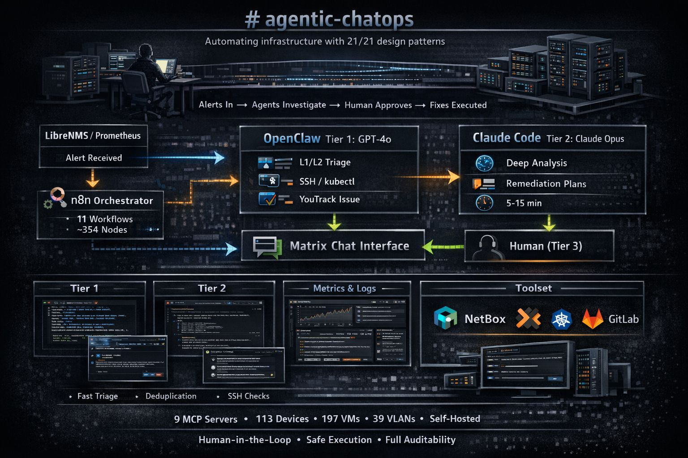

# agentic-chatops

AI agents that triage infrastructure alerts, investigate root causes, and propose fixes — while a solo operator sleeps.

> **For the complete technical reference, see [README.extensive.md](README.extensive.md).**



## The Problem

One person. **310+ infrastructure objects** across 6 sites. 3 firewalls, 12 Kubernetes nodes, self-hosted everything. When an alert fires at 3am, there's no team to call. There never is.

## The Solution

Three agentic subsystems that handle the detective work — **ChatOps** (infrastructure), **ChatSecOps** (security), **ChatDevOps** (CI/CD) — built on [n8n](https://n8n.io/) orchestration, [Matrix](https://matrix.org/) as the human interface, and a 3-tier agent architecture. The human stays in the loop for every infrastructure change. The system never acts without a thumbs-up or poll vote.

---

## What Makes This Different

### Self-Improving Prompts (nobody else does this)

The system evaluates its own performance and auto-patches its prompts. Every session is scored by an [LLM-as-a-Judge](https://arxiv.org/abs/2306.05685) on 5 quality dimensions. When a dimension averages below threshold over 30 days, a targeted instruction patch is generated and injected into the next session's prompt. Patches auto-expire after 30 days and are re-evaluated by the monthly [eval flywheel](scripts/eval-flywheel.sh).

```
Session → LLM Judge (5 dims) → prompt-improver.py detects low score
  → generates patch → config/prompt-patches.json → Build Prompt reads it
  → next session gets improved instructions → re-scored → loop closes
```

### AI Planner Wired to Proven Ansible Playbooks

Before Claude Code investigates, a Haiku planner generates a 3-5 step investigation plan. The planner queries AWX for matching Ansible playbooks from **41 proven templates** (maintenance, cert sync, K8s drain, PVE updates, DMZ deployments). Plans naturally include "Run AWX Template 64 with dry_run=true" as remediation steps — bridging AI reasoning with proven automation.

### Predictive Alerting

Instead of only reacting after alerts fire, the system queries LibreNMS API daily for **trending risk** across both sites. Devices are scored on disk usage trends, alert frequency, and health signals. A daily top-10 risk report posts to Matrix before problems become incidents.

### 5-Signal RAG + GraphRAG + Staleness + Temporal Filter + mtime-Sort

Retrieval uses [Reciprocal Rank Fusion](docs/industry-agentic-references.md#5-rag--retrieval-optimization) across **5 signals** (semantic + keyword + [compiled wiki](wiki/index.md) + [MemPalace](https://github.com/milla-jovovich/mempalace) transcripts + chaos baselines), plus a **GraphRAG knowledge graph** (360 entities, 193 relationships). Retrieval short-circuits via two intent detectors: **temporal window** ("last 48h", "72 hours ending YYYY-MM-DD") filters wiki on `source_mtime`, and **mtime-sort intent** ("name any three memory files created in the last 48h") bypasses semantic retrieval entirely and returns an mtime-ranked window. Results older than 7 days get age-proportional staleness warnings. A **Haiku synth step** composes cross-chunk answers when top rerank < threshold (3-4× faster p95 than the Ollama ensemble). `SYNTH_HAIKU_FORCE_FAIL` env supports 5 failure modes (429 / auth / timeout / network / empty) that all fall back cleanly to local qwen2.5.

### Karpathy-Style Compiled Knowledge Base

Following [Andrej Karpathy's LLM Knowledge Bases pattern](https://x.com/karpathy/status/2039805659525644595): raw data from 7+ sources (117 memory files, 55 CLAUDE.md files, 33 incidents, 27 lessons, 101 OpenClaw memories, 17 skills, ~5,200 lab docs) is compiled into a browsable [44-article wiki](wiki/index.md) with auto-maintained indexes, daily SHA-256 incremental recompilation, and contradiction detection. All articles embedded into RAG as the 3rd fusion signal.

### Full Observability Stack with OTel

88,448 tool calls instrumented across 108 tool types with per-tool error rates and latency percentiles. 39K OTel spans across 94 traces exported to OpenObserve (OTLP). 10 Grafana dashboards (64+ panels) covering ChatOps, ChatSecOps, ChatDevOps, and trace analysis. 18,220 infrastructure commands logged across 232 devices.

### Formal Evaluation Pipeline

58 scenarios across [3 eval sets](docs/evaluation-process.md) (22 regression + 20 discovery + 16 holdout) + 54 adversarial red-team tests. [Prompt Scorecard](scripts/grade-prompts.sh) grades 19 surfaces daily on 6 dimensions. [Agent Trajectory](scripts/score-trajectory.sh) scoring on 8 infra / 4 dev steps. A/B variant testing (react_v1 vs react_v2). CI eval gate blocks bad merges. Monthly eval flywheel cycle.

---

## Architecture

```
Alert → n8n → OpenClaw (GPT-5.1, 7-21s) → Haiku Planner (+AWX) → Claude Code (Opus 4.6, 5-15min) → Human (Matrix)
```

| Component | Role |
|-----------|------|
| **[n8n](https://n8n.io/)** | 25 workflows (424 nodes) — alert intake, session management, knowledge population |
| **[OpenClaw](https://openclaw.com/)** v2026.4.11 (GPT-5.1) | Tier 1 — fast triage with 17 skills + Active Memory, handles 80%+ without escalation |
| **[Claude Code](https://docs.anthropic.com/)** (Opus 4.6) | Tier 2 — 10 sub-agents, ReAct reasoning, interactive [POLL] approval |
| **[AWX](https://www.ansible.com/awx)** | 41 Ansible playbooks wired into AI planner |
| **Matrix** (Synapse) | Human-in-the-loop — polls, reactions, replies |
| **Prometheus + Grafana** | 10 dashboards, 64+ panels, 10 metric exporters |
| **OpenObserve** | OTel tracing — 39K spans, OTLP export |
| **Ollama** (RTX 3090 Ti) | Local embeddings — nomic-embed-text, query rewriting |
| **[Compiled Wiki](wiki/index.md)** | 44 articles from 7+ sources, daily recompilation |

## Safety — 7 Layers

The system investigates freely but **never executes infrastructure changes without human approval**:

1. **Claude Code hooks** — 7 injection detection groups + 59 destructive/exfiltration patterns blocked deterministically
2. **safe-exec.sh** — code-level blocklist that prompt injection cannot bypass
3. **exec-approvals.json** — 36 specific skill patterns (no wildcards)
4. **Evaluator-Optimizer** — Haiku screens high-stakes responses before posting
5. **Confidence gating** — < 0.5 stops, < 0.7 escalates
6. **Budget ceilings** — EUR 5/session warning, $25/day plan-only mode
7. **Credential scanning** — 16 PII patterns redacted, 39 credentials tracked with rotation

## Key Numbers

| Metric | Value |
|--------|-------|
| Operational activation audit | [A (91.8%)](docs/operational-activation-audit-2026-04-10.md) — 23 tables populated, 148K+ rows |
| Agentic design patterns | [21/21](docs/agentic-patterns-audit.md) at A+ ([tri-source audit](docs/tri-source-audit.md): 11/11 dimensions) |
| AWX/Ansible runbooks | 41 playbooks wired into Plan-and-Execute |
| Tool call instrumentation | 88,448 calls across 108 types, per-tool error rates + latency p50/p95 |
| OTel tracing | 39K spans → OpenObserve + Prometheus metrics |
| GraphRAG knowledge graph | 360 entities, 193 relationships |
| Self-improving prompt patches | 5 active (auto-generated from eval scores) |
| Predictive risk scoring | 123 devices scanned daily, 23 at elevated risk |
| Holistic health check | [96%+](scripts/holistic-agentic-health.sh) — 142 checks (functional + e2e + cross-site) |
| Session-holistic E2E | **100% (23/23)** — covers 18 YT issues with before/after scoring |
| Industry benchmark | [4.10/5.00 (82%)](docs/industry-benchmark-2026-04-15.md) -- 15 dimensions, 23 industry sources, E2E certified (39/39) |
| RAGAS golden set | 33 queries (15 hard-eval tagged) — multi-hop / temporal / negation / meta / cross-corpus |
| Weekly hard-eval (50-q) | judge-graded hit@5 = 0.90, p50 5.7s, p95 13.6s |
| RAGAS RAG quality | Faithfulness 0.88, Precision 0.86, Recall 0.88 (18 evaluations via Claude Haiku) |
| NIST behavioral telemetry | 5/5 AG-MS.1 signals active (action velocity, permission escalation, cross-boundary, delegation depth, exception rate) |
| Adversarial red-team | 54 tests (32 baseline + 22 adversarial), quarterly schedule, 12 bypass vectors hardened |
| Governance compliance | EU AI Act limited-risk assessment, QMS (Art. 17), NIST oversight boundary framework |
| Supply chain security | CycloneDX SBOM in CI, model provenance chain, agent decommissioning procedure |

## Documentation

| Document | What it covers |
|----------|---------------|
| [Operational Activation Audit](docs/operational-activation-audit-2026-04-10.md) | Scores data activation — 21/21 tables, 109K rows |
| [Tri-Source Audit](docs/tri-source-audit.md) | 11/11 dimensions A+ (Gulli + Anthropic + industry) |
| [External Source Mapping](docs/external-source-implementation-mapping-2026-04-11.md) | atlas-agents + claude-code-from-source techniques applied |
| [Agentic Patterns Audit](docs/agentic-patterns-audit.md) | 21/21 pattern scorecard |
| [Evaluation Process](docs/evaluation-process.md) | 3-set eval, flywheel, CI gate |
| [ACI Tool Audit](docs/aci-tool-audit.md) | 10 MCP tools against 8-point checklist |
| [Compiled Wiki](wiki/index.md) | 44 auto-compiled articles |
| [Industry Benchmark](docs/industry-benchmark-2026-04-15.md) | 15-dimension scored assessment against 23 industry sources |
| [EU AI Act Assessment](docs/eu-ai-act-assessment.md) | Risk classification + article mapping |
| [Tool Risk Classification](docs/tool-risk-classification.md) | 153 MCP tools classified (NIST AG-MP.1) |
| [Agent Decommissioning](docs/agent-decommissioning.md) | Per-tier lifecycle procedures |
| [Installation Guide](docs/installation.md) | Setup steps + cron configuration |

## Quick Start

```bash
git clone https://github.com/papadopouloskyriakos/agentic-chatops.git
cd agentic-chatops
cp .env.example .env   # Add your credentials
```

See the [Installation Guide](docs/installation.md) for full setup.

## References

1. **[Agentic Design Patterns](https://drive.google.com/file/d/1-5ho2aSZ-z0FcW8W_jMUoFSQ5hTKvJ43/view?usp=drivesdk)** by Antonio Gulli (Springer, 2025) — 21 patterns, all implemented
2. **[Claude Certified Architect – Foundations](docs/Claude+Certified+Architect+–+Foundations+Certification+Exam+Guide.pdf)** (Anthropic) — sub-agent design
3. **[Industry References](docs/industry-agentic-references.md)** — Anthropic, OpenAI, LangChain, Microsoft
4. **[atlas-agents](https://github.com/agulli/atlas-agents)** + **[claude-code-from-source](https://github.com/alejandrobalderas/claude-code-from-source)** — external techniques applied

## License

Sanitized mirror of a private GitLab repository. Provided as-is for educational and reference purposes.

---

*Built by a solo infrastructure operator who got tired of waking up at 3am for alerts that an AI could triage.*
